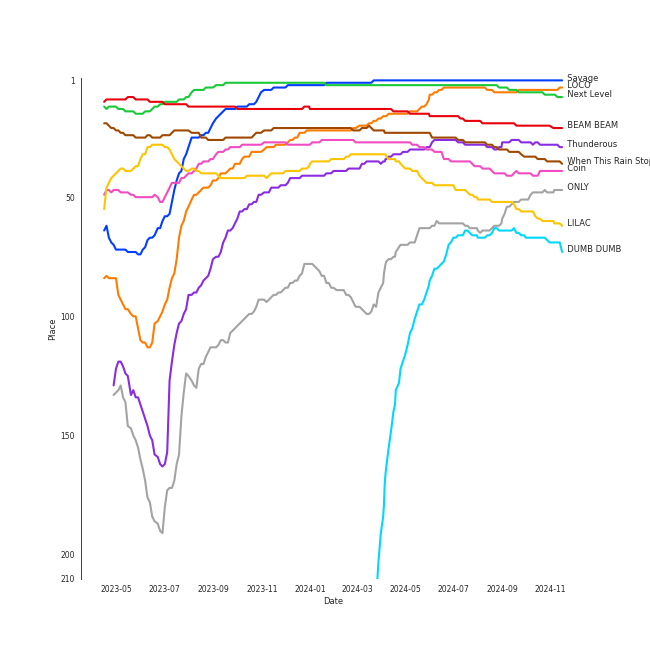

# Tracks in Your Top Songs 2022 from 2021

## Artists

| Art | Rank | Tracks | 💚 | Artist | 🔗 |
|:---|---:|---:|---:|:---|:---|
|  | 1 | 4 | 4 | [aespa](../../../artists/aespa/overview.md) | [🔗](https://open.spotify.com/artist/6YVMFz59CuY7ngCxTxjpxE) |
|  | 9 | 2 | 2 | [TWICE](../../../artists/twice/overview.md) | [🔗](https://open.spotify.com/artist/7n2Ycct7Beij7Dj7meI4X0) |
|  | 11 | 2 | 2 | [LeeHi](../../../artists/leehi/overview.md) | [🔗](https://open.spotify.com/artist/7cVZApDoQZpS447nHTsNqu) |
|  | 7 | 2 | 2 | [ENHYPEN](../../../artists/enhypen/overview.md) | [🔗](https://open.spotify.com/artist/5t5FqBwTcgKTaWmfEbwQY9) |
|  | 4 | 2 | 2 | [IU](../../../artists/iu/overview.md) | [🔗](https://open.spotify.com/artist/3HqSLMAZ3g3d5poNaI7GOU) |
|  | 10 | 2 | 2 | [Stray Kids](../../../artists/stray_kids/overview.md) | [🔗](https://open.spotify.com/artist/2dIgFjalVxs4ThymZ67YCE) |
|  | 5 | 2 | 2 | [ITZY](../../../artists/itzy/overview.md) | [🔗](https://open.spotify.com/artist/2KC9Qb60EaY0kW4eH68vr3) |
|  | 68 | 1 | 1 | JEON SOMI | [🔗](https://open.spotify.com/artist/7zYj9S9SdIunYCfSm7vzAR) |
|  | 45 | 1 | 1 | [HWASA](../../../artists/hwasa/overview.md) | [🔗](https://open.spotify.com/artist/7bmYpVgQub656uNTu6qGNQ) |
|  | 26 | 1 | 1 | [JEON SOYEON](../../../artists/jeon_soyeon/overview.md) | [🔗](https://open.spotify.com/artist/6Xg22wJOAcnvPUfk5WvODH) |

View all

| Art | Rank | Tracks | 💚 | Artist | 🔗 |
|:---|---:|---:|---:|:---|:---|
|  | 17 | 1 | 1 | [IVE](../../../artists/ive/overview.md) | [🔗](https://open.spotify.com/artist/6RHTUrRF63xao58xh9FXYJ) |
|  | 191 | 1 | 1 | MINGYU | [🔗](https://open.spotify.com/artist/5gUpo0BRmo6EOTbyU3z5Ay) |
|  | 65 | 1 | 1 | [Solar](../../../artists/solar/overview.md) | [🔗](https://open.spotify.com/artist/5cYcI546S8Lf97m4mNdYLD) |
|  | 29 | 1 | 1 | [Dreamcatcher](../../../artists/dreamcatcher/overview.md) | [🔗](https://open.spotify.com/artist/5V1qsQHdXNm4ZEZHWvFnqQ) |
|  | 192 | 1 | 1 | WONWOO | [🔗](https://open.spotify.com/artist/3rHcBT06Vb1XGVUWhDALZt) |
|  | 170 | 1 | 1 | ROSÉ | [🔗](https://open.spotify.com/artist/3eVa5w3URK5duf6eyVDbu9) |
|  | 24 | 1 | 1 | [NCT DREAM](../../../artists/nct_dream/overview.md) | [🔗](https://open.spotify.com/artist/1gBUSTR3TyDdTVFIaQnc02) |
|  | 28 | 1 | 1 | [WENDY](../../../artists/wendy/overview.md) | [🔗](https://open.spotify.com/artist/0FRUZvZNPzM3YJMABJxf2K) |
|  | 144 | 1 | 0 | TAEYONG | [🔗](https://open.spotify.com/artist/6SKusTjOAPsTZ6kareKQdm) |
|  | 414 | 1 | 0 | YANGYANG | [🔗](https://open.spotify.com/artist/5yyf4YDCKGaa71SC7KRw2L) |
|  | 414 | 1 | 0 | HENDERY | [🔗](https://open.spotify.com/artist/5wrZ59w1ndSBlPeUj2f6Fs) |
|  | 414 | 1 | 0 | JENO | [🔗](https://open.spotify.com/artist/3DZrLuJOQFKqV2sjMsKb1V) |
|  | 414 | 1 | 0 | GISELLE | [🔗](https://open.spotify.com/artist/2P1id80CMwR5R5cwcyIIAi) |

## Albums

| Art | Rank | Tracks | 💚 | Album | Release Date | 🔗 |
|:---|---:|---:|---:|:---|:---|:---|
|  | 6 | 2 | 2 | Savage - The 1st Mini Album | 2021-10-05 | [🔗](https://open.spotify.com/album/3vyyDkvYWC36DwgZCYd3Wu) |
|  | 32 | 2 | 2 | NOEASY | 2021-08-23 | [🔗](https://open.spotify.com/album/558tpdCejjVQNFAumRAeQj) |
|  | 5 | 2 | 2 | IU 5th Album 'LILAC' | 2021-03-25 | [🔗](https://open.spotify.com/album/01dPJcwyht77brL4JQiR8R) |
|  | 124 | 2 | 2 | Formula of Love: O+T=<3 | 2021-11-12 | [🔗](https://open.spotify.com/album/5052Ip89wdW8EGdpjEpNeq) |
|  | 400 | 1 | 1 | [Dystopia : Road to Utopia] | 2021-01-26 | [🔗](https://open.spotify.com/album/1EyLcB9R1KfUV45AxtRR3V) |
|  | 19 | 1 | 1 | Windy | 2021-07-05 | [🔗](https://open.spotify.com/album/1lv92CIVZbB2BsHmIx7qJf) |
|  | 78 | 1 | 1 | VINCENZO (Original Television Soundtrack) Pt. 3 | 2021-03-14 | [🔗](https://open.spotify.com/album/47ulDGfVUWUcUSWRQCzxr3) |
|  | 196 | 1 | 1 | R | 2021-03-12 | [🔗](https://open.spotify.com/album/5BQcoDfcZ8aBcikYX9B7Ob) |
|  | 9 | 1 | 1 | Next Level | 2021-05-17 | [🔗](https://open.spotify.com/album/2CzbrboOLzeRoaaH1N5K0N) |
|  | 20 | 1 | 1 | Like Water - The 1st Mini Album | 2021-04-05 | [🔗](https://open.spotify.com/album/1Ao5vWPO13f4l0ldwxOKL7) |

View all

| Art | Rank | Tracks | 💚 | Album | Release Date | 🔗 |
|:---|---:|---:|---:|:---|:---|:---|
|  | 237 | 1 | 1 | Hot Sauce - The 1st Album | 2021-05-10 | [🔗](https://open.spotify.com/album/1miTgxRTUje9Jqml1aOSUi) |
|  | 612 | 1 | 1 | Guilty Pleasure | 2021-11-24 | [🔗](https://open.spotify.com/album/7jke1vYOze3jdyTiWhtFnz) |
|  | 183 | 1 | 1 | GUESS WHO | 2021-04-30 | [🔗](https://open.spotify.com/album/4lS8nhX8cplsYPzKjvhw6G) |
|  | 342 | 1 | 1 | ELEVEN | 2021-12-01 | [🔗](https://open.spotify.com/album/1XMYvsHRt52sMi6wittWqI) |
|  | 612 | 1 | 1 | Dreams Come True - SM STATION | 2021-12-20 | [🔗](https://open.spotify.com/album/4Jzx0XAORPKQ3v7EaL8Ful) |
|  | 64 | 1 | 1 | DUMB DUMB | 2021-08-02 | [🔗](https://open.spotify.com/album/24sFioeGsPtxa5fD6VzL8b) |
|  | 113 | 1 | 1 | DIMENSION : DILEMMA | 2021-10-12 | [🔗](https://open.spotify.com/album/5jGRqioNCSWZGBl3QmyuFI) |
|  | 10 | 1 | 1 | CRAZY IN LOVE | 2021-09-24 | [🔗](https://open.spotify.com/album/4U7rGOkJgtxs27H9L93Xli) |
|  | 222 | 1 | 1 | Bittersweet (feat. LeeHi) | 2021-05-28 | [🔗](https://open.spotify.com/album/6qVk855QPCh57noNeeHMXQ) |
|  | 160 | 1 | 1 | BORDER : CARNIVAL | 2021-04-26 | [🔗](https://open.spotify.com/album/4LGYBcRsteiXjcPD4QQvxv) |
|  | 61 | 1 | 1 | 4 ONLY | 2021-09-09 | [🔗](https://open.spotify.com/album/1DKgZeAYrjslAPZVMe6EFt) |
|  | 612 | 1 | 0 | 2021 Winter SMTOWN : SMCU EXPRESS | 2021-12-27 | [🔗](https://open.spotify.com/album/3dn2in6doTc6zfA0G2UFDZ) |

## Tracks

| Art | Track | Album | Artists | Label | Rank | 💚 | 🔗 |
|:---|:---|:---|:---|:---|---:|:---|:---|
|  | Savage | Savage - The 1st Mini Album | [aespa](../../../artists/aespa/overview.md) | [SM Entertainment](../../../labels/sm_entertainment) | 1 | 💚 | [🔗](https://open.spotify.com/track/3dbLT62Cvs46Ju7a8gpr36) |
|  | Next Level | Next Level | [aespa](../../../artists/aespa/overview.md) | [SM Entertainment](../../../labels/sm_entertainment) | 3 | 💚 | [🔗](https://open.spotify.com/track/2zrhoHlFKxFTRF5aMyxMoQ) |
|  | LOCO | CRAZY IN LOVE | [ITZY](../../../artists/itzy/overview.md) | [Republic Records](../../../labels/republic_records) | 4 | 💚 | [🔗](https://open.spotify.com/track/56Yxkm62GtEpnPyG7TvwLY) |
|  | BEAM BEAM | Windy | [JEON SOYEON](../../../artists/jeon_soyeon/overview.md) | [Universal Music LLC](../../../labels/universal_music_llc) | 18 | 💚 | [🔗](https://open.spotify.com/track/1VjIS4qoyD6JS2rNZQgE00) |
|  | When This Rain Stops | Like Water - The 1st Mini Album | [WENDY](../../../artists/wendy/overview.md) | [SM Entertainment](../../../labels/sm_entertainment) | 27 | 💚 | [🔗](https://open.spotify.com/track/6mavVLsxaa4YcPje9qZKcf) |
|  | Thunderous | NOEASY | [Stray Kids](../../../artists/stray_kids/overview.md) | [Republic Records](../../../labels/republic_records) | 28 | 💚 | [🔗](https://open.spotify.com/track/0nwTMzpatarzvLvtwwzdCt) |
|  | Coin | IU 5th Album 'LILAC' | [IU](../../../artists/iu/overview.md) | [EDAM Entertainment](../../../labels/edam_entertainment) | 38 | 💚 | [🔗](https://open.spotify.com/track/7CZRguMolNqIobnXxpV735) |
|  | LILAC | IU 5th Album 'LILAC' | [IU](../../../artists/iu/overview.md) | [EDAM Entertainment](../../../labels/edam_entertainment) | 51 | 💚 | [🔗](https://open.spotify.com/track/5xrtzzzikpG3BLbo4q1Yul) |
|  | ONLY | 4 ONLY | [LeeHi](../../../artists/leehi/overview.md) | [Genie Music Corporation](../../../labels/genie_music_corporation), [Stone Music Entertainment](../../../labels/stone_music_entertainment) | 65 | 💚 | [🔗](https://open.spotify.com/track/6TBJkXHPhu3EsMk1bshwuI) |
|  | DUMB DUMB | DUMB DUMB | JEON SOMI | [THE BLACK LABEL/Interscope Records](../../../labels/interscope_records) | 67 | 💚 | [🔗](https://open.spotify.com/track/0dnkOK5hGUCmIJ7FDF0yHz) |

View all

| Art | Track | Album | Artists | Label | Rank | 💚 | 🔗 |
|:---|:---|:---|:---|:---|---:|:---|:---|
|  | Adrenaline | VINCENZO (Original Television Soundtrack) Pt. 3 | [Solar](../../../artists/solar/overview.md) | [Genie Music Corporation](../../../labels/genie_music_corporation) | 80 | 💚 | [🔗](https://open.spotify.com/track/6ZQmJVUuXk1Q27d8vkmgm8) |
|  | YEPPI YEPPI | Savage - The 1st Mini Album | [aespa](../../../artists/aespa/overview.md) | [SM Entertainment](../../../labels/sm_entertainment) | 127 | 💚 | [🔗](https://open.spotify.com/track/3UKKwGrpWWamc0XNSKXjmz) |
|  | Just A Little Bit | DIMENSION : DILEMMA | [ENHYPEN](../../../artists/enhypen/overview.md) | [BELIFT LAB](../../../labels/belift_lab) | 150 | 💚 | [🔗](https://open.spotify.com/track/3QdjLOemIcMZovVOnvJP7P) |
|  | The Feels | Formula of Love: O+T=<3 | [TWICE](../../../artists/twice/overview.md) | [Republic Records](../../../labels/republic_records) | 155 | 💚 | [🔗](https://open.spotify.com/track/308Ir17KlNdlrbVLHWhlLe) |
|  | FEVER | BORDER : CARNIVAL | [ENHYPEN](../../../artists/enhypen/overview.md) | [BELIFT LAB](../../../labels/belift_lab) | 238 | 💚 | [🔗](https://open.spotify.com/track/0UzymivvUH5s8z4PeWZJaK) |
|  | In the morning | GUESS WHO | [ITZY](../../../artists/itzy/overview.md) | [Republic Records](../../../labels/republic_records) | 252 | 💚 | [🔗](https://open.spotify.com/track/1Wcr8zrKqbUX0zwN8Dbr16) |
|  | Gone | R | ROSÉ | [Interscope Records](../../../labels/interscope_records), [YG Entertainment](../../../labels/yg_entertainment) | 265 | 💚 | [🔗](https://open.spotify.com/track/2dHoVW9AxJVSRebPRyV2aA) |
|  | Bittersweet (feat. LeeHi) | Bittersweet (feat. LeeHi) | WONWOO, MINGYU, [LeeHi](../../../artists/leehi/overview.md) | [PLEDIS Entertainment](../../../labels/pledis_entertainment) | 301 | 💚 | [🔗](https://open.spotify.com/track/347PJwH4XqRbeaKaIW9sX3) |
|  | Hot Sauce | Hot Sauce - The 1st Album | [NCT DREAM](../../../artists/nct_dream/overview.md) | [SM Entertainment](../../../labels/sm_entertainment) | 326 | 💚 | [🔗](https://open.spotify.com/track/6B8MM3PVQtUbZLay7tP7er) |
|  | ELEVEN | ELEVEN | [IVE](../../../artists/ive/overview.md) | [STARSHIP Entertainment](../../../labels/starship_entertainment) | 492 | 💚 | [🔗](https://open.spotify.com/track/7n2FZQsaLb7ZRfRPfEeIvr) |
|  | Odd Eye | [Dystopia : Road to Utopia] | [Dreamcatcher](../../../artists/dreamcatcher/overview.md) | [DREAMCATCHER COMPANY](../../../labels/dreamcatcher_company) | 593 | 💚 | [🔗](https://open.spotify.com/track/1RtlbxsPpDBsHHmGTb7ah2) |
|  | Red Lights (Bang Chan, Hyunjin) | NOEASY | [Stray Kids](../../../artists/stray_kids/overview.md) | [Republic Records](../../../labels/republic_records) | 921 | 💚 | [🔗](https://open.spotify.com/track/0LatE4S9UtCDwIdGQsFFKL) |
|  | CRUEL | Formula of Love: O+T=<3 | [TWICE](../../../artists/twice/overview.md) | [Republic Records](../../../labels/republic_records) | 921 | 💚 | [🔗](https://open.spotify.com/track/139JUU8fJkQoeHl9nABk9C) |
|  | I`m a B | Guilty Pleasure | [HWASA](../../../artists/hwasa/overview.md) | [RBW Inc.](../../../labels/rbw_inc_) | 921 | 💚 | [🔗](https://open.spotify.com/track/1AToLLvWghQgiBFef1iGuR) |
|  | Dreams Come True | Dreams Come True - SM STATION | [aespa](../../../artists/aespa/overview.md) | [SM Entertainment](../../../labels/sm_entertainment) | 921 | 💚 | [🔗](https://open.spotify.com/track/6rVCUwfnuYTAsX4P9fIdIu) |
|  | ZOO | 2021 Winter SMTOWN : SMCU EXPRESS | TAEYONG, JENO, HENDERY, YANGYANG, GISELLE | [SM Entertainment](../../../labels/sm_entertainment) | 921 | | [🔗](https://open.spotify.com/track/7eVu7FI02cTicLEgVtUvwF) |

