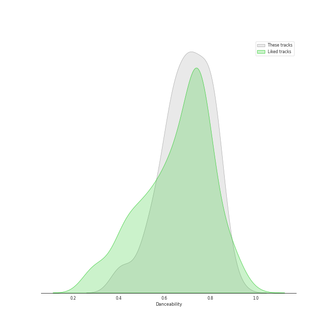
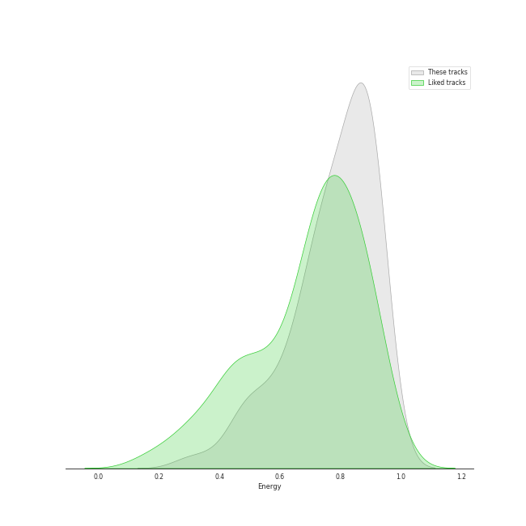
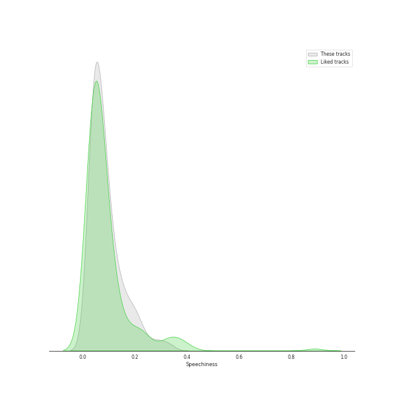
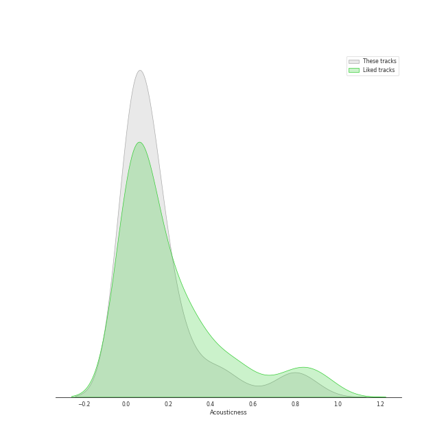
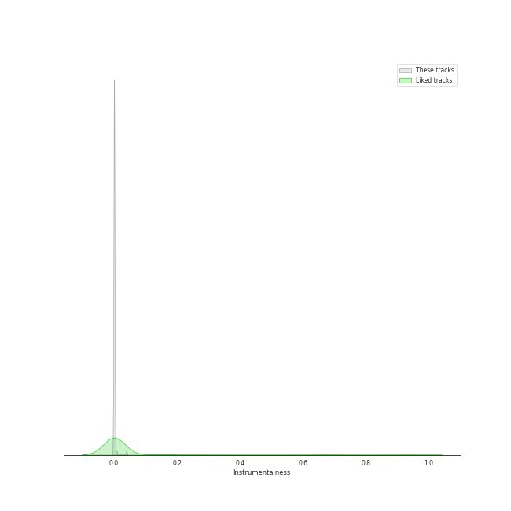
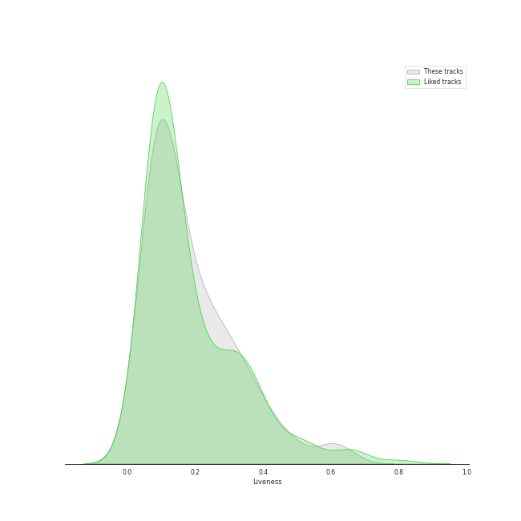
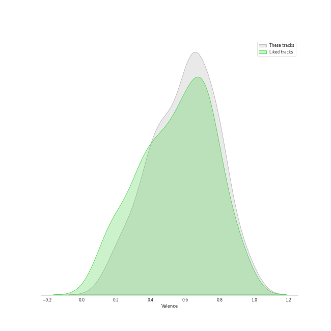
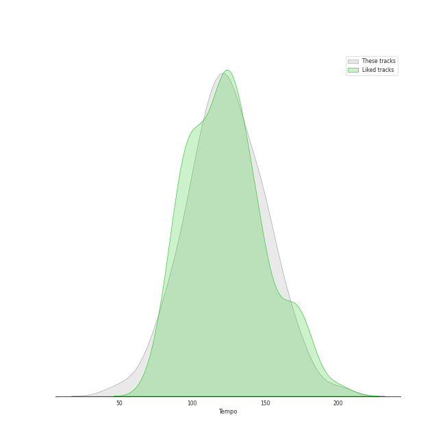

# Track Features for Your Top Songs 2022

## Danceability

| ​ | 10 most Danceable tracks | ​​ | 10 least Danceable tracks |
|:---|:---|:---|:---|
|  | BOOM (0.914) |  | O.O (0.389) |
|  | Breakthrough (0.868) |  | HOLO (0.406) |
|  | Dolphin (0.858) |  | Feel My Rhythm (0.412) |
|  | DUMB DUMB (0.851) |  | Just A Little Bit (0.441) |
|  | In the morning (0.846) |  | Adrenaline (0.491) |
|  | CRUEL (0.84) |  | Devil (0.506) |
|  | BBIBBI (0.839) |  | Black Mamba (0.52) |
|  | Peek-A-Boo (0.839) |  | Gotta Go (0.531) |
|  | ELEVEN (0.828) |  | ONLY (0.536) |
|  | Bittersweet (feat. LeeHi) (0.824) |  | Odd Eye (0.537) |

## Energy

| ​ | 10 most Energetic tracks | ​​ | 10 least Energetic tracks |
|:---|:---|:---|:---|
|  | Heart Shaker (0.944) |  | ONLY (0.296) |
|  | HOME;RUN (0.942) |  | Gone (0.377) |
|  | Feel My Rhythm (0.94) |  | Butter (0.459) |
|  | Ice Cream Cake (0.935) |  | 무제(無題) (Untitled, 2014) (0.461) |
|  | Odd Eye (0.932) |  | HOLO (0.474) |
|  | DESSERT (0.927) |  | Dream (0.476) |
|  | Hot Sauce (0.926) |  | 눈,코,입 (Eyes, Nose, Lips) (0.516) |
|  | ZOO (0.923) |  | BOOM (0.516) |
|  | Yummy Yummy Love (0.922) |  | When This Rain Stops (0.521) |
|  | Red Flavor (0.917) |  | Pretty Savage (0.556) |

## Speechiness

| ​ | 10 most Speechy tracks | ​​ | 10 least Speechy tracks |
|:---|:---|:---|:---|
|  | BBIBBI (0.331) |  | Something (0.0285) |
|  | O.O (0.297) |  | HOLO (0.0295) |
|  | Back Door (0.272) |  | RBB (Really Bad Boy) (0.0317) |
|  | Thunderous (0.234) |  | HOLD MY HAND (0.0317) |
|  | LATATA (0.224) |  | 무제(無題) (Untitled, 2014) (0.0321) |
|  | Feel My Rhythm (0.215) |  | Lion Heart (0.0322) |
|  | Naughty (0.208) |  | Amusement Park (0.0333) |
|  | Kill This Love (0.191) |  | The Eve (0.0334) |
|  | Red Flavor (0.189) |  | Still Life (0.034) |
|  | Ice Cream Cake (0.189) |  | Adrenaline (0.0345) |

## Acousticness

| ​ | 10 most Acoustic tracks | ​​ | 10 least Acoustic tracks |
|:---|:---|:---|:---|
|  | ONLY (0.892) |  | WA DA DA (0.00122) |
|  | Amusement Park (0.85) |  | BOOMBAYAH (0.00268) |
|  | When This Rain Stops (0.805) |  | Butter (0.00323) |
|  | 무제(無題) (Untitled, 2014) (0.785) |  | LATATA (0.00427) |
|  | HOLO (0.768) |  | MAGO (0.00548) |
|  | 눈,코,입 (Eyes, Nose, Lips) (0.736) |  | WHISTLE (0.00561) |
|  | Gone (0.594) |  | I Am The Best (0.00767) |
|  | Next Level (0.488) |  | WANNABE (0.00795) |
|  | Polaroid Love (0.458) |  | Coin (0.00849) |
|  | Still Life (0.443) |  | Pretty Savage (0.00886) |

## Instrumentalness

| ​ | 10 most Instrumental tracks | ​​ | 10 least Instrumental tracks |
|:---|:---|:---|:---|
|  | YEPPI YEPPI (0.0391) |  | Red Lights (Bang Chan, Hyunjin) (0.0) |
|  | I Am The Best (0.00834) |  | FEVER (0.0) |
|  | Lion Heart (0.00274) |  | Back Door (0.0) |
|  | Peek-A-Boo (0.00257) |  | 눈,코,입 (Eyes, Nose, Lips) (0.0) |
|  | Kill This Love (0.00221) |  | Thunderous (0.0) |
|  | Black Mamba (0.000946) |  | CRUEL (0.0) |
|  | In the morning (0.00094) |  | SO BAD (0.0) |
|  | MAGO (0.000578) |  | BOOMBAYAH (0.0) |
|  | RBB (Really Bad Boy) (0.000239) |  | Devil (0.0) |
|  | 러시안 룰렛 Russian Roulette (0.000225) |  | Daisy (0.0) |

## Liveness

| ​ | 10 most Live tracks | ​​ | 10 least Live tracks |
|:---|:---|:---|:---|
|  | FANCY (0.627) |  | YEPPI YEPPI (0.029) |
|  | Red Lights (Bang Chan, Hyunjin) (0.612) |  | BOOM (0.0441) |
|  | Step Back (0.596) |  | ELEVEN (0.048) |
|  | BOOMBAYAH (0.497) |  | Bad Boy (0.0553) |
|  | I CAN'T STOP ME (0.463) |  | I Am The Best (0.056) |
|  | Can't Control Myself (0.453) |  | ZOO (0.0571) |
|  | Pity Party (0.418) |  | O.O (0.0598) |
|  | Yummy Yummy Love (0.414) |  | How You Like That (0.0601) |
|  | HELICOPTER (0.383) |  | SO BAD (0.0616) |
|  | DESSERT (0.373) |  | Still Life (0.0628) |

## Valence

| ​ | 10 most Happy tracks | ​​ | 10 least Happy tracks |
|:---|:---|:---|:---|
|  | Lion Heart (0.961) |  | ONLY (0.151) |
|  | 러시안 룰렛 Russian Roulette (0.958) |  | Adrenaline (0.175) |
|  | Left & Right (0.95) |  | HOLO (0.206) |
|  | I`m a B (0.927) |  | Can't Control Myself (0.229) |
|  | The Feels (0.922) |  | Still Life (0.239) |
|  | Heart Shaker (0.857) |  | 눈,코,입 (Eyes, Nose, Lips) (0.254) |
|  | HIP (0.824) |  | 무제(無題) (Untitled, 2014) (0.263) |
|  | BBIBBI (0.821) |  | O.O (0.295) |
|  | Next Level (0.82) |  | Amusement Park (0.299) |
|  | CRUEL (0.82) |  | Pretty Savage (0.333) |

## Tempo

| ​ | 10 most Fast tracks | ​​ | 10 least Fast tracks |
|:---|:---|:---|:---|
|  | O.O (200.263) |  | Dream (48.973) |
|  | HOLO (179.914) |  | Run Devil Run (64.927) |
|  | Thunderous (172.156) |  | FEVER (72.999) |
|  | Ice Cream Cake (172.023) |  | Devil (74.898) |
|  | What is Love? (169.966) |  | 무제(無題) (Untitled, 2014) (79.826) |
|  | SO BAD (168.978) |  | Gone (79.936) |
|  | Heart Shaker (164.062) |  | Just A Little Bit (84.633) |
|  | Step Back (161.897) |  | Amusement Park (84.925) |
|  | Odd Eye (160.058) |  | Daisy (85.016) |
|  | Feel My Rhythm (157.964) |  | Can't Control Myself (85.044) |
