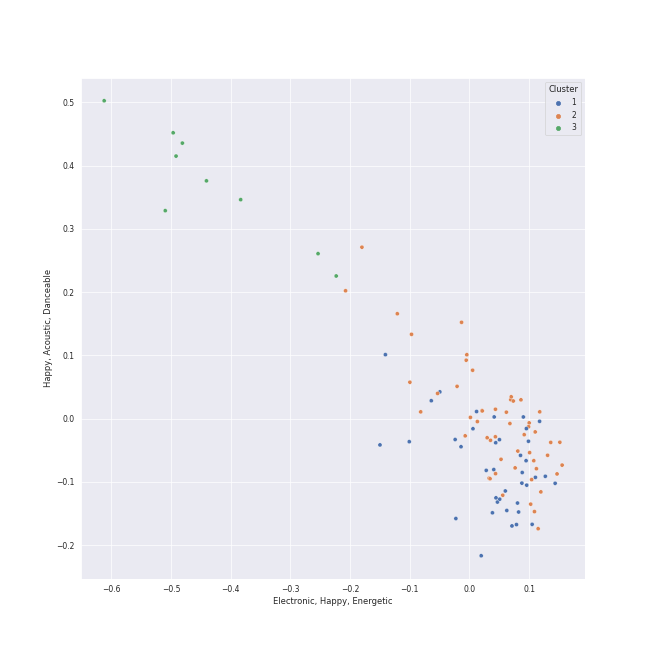

# Clusters in Your Top Songs 2022

## Cluster #1

49 tracks

| Art | Track | Album | Artists | Label | Rank | 💚 | 🔗 |
|:---|:---|:---|:---|:---|---:|:---|:---|
|  | In the morning | GUESS WHO | [ITZY](../../../../artists/itzy/overview.md) | [Republic Records](../../../../labels/republic_records) | 462 | 💚 | [🔗](https://open.spotify.com/track/1Wcr8zrKqbUX0zwN8Dbr16) |
|  | ICY | IT'z ICY | [ITZY](../../../../artists/itzy/overview.md) | [Republic Records](../../../../labels/republic_records) | nan | 💚 | [🔗](https://open.spotify.com/track/2vdkN2NSQ5mxqNGg7sJUxs) |
|  | Dumb Dumb | The Red - The 1st Album | [Red Velvet](../../../../artists/red_velvet/overview.md) | [SM Entertainment](../../../../labels/sm_entertainment) | 26 | 💚 | [🔗](https://open.spotify.com/track/64iDjAuWDogVhuoWhKklF9) |
|  | LILAC | IU 5th Album 'LILAC' | [IU](../../../../artists/iu/overview.md) | [EDAM Entertainment](../../../../labels/edam_entertainment) | 35 | 💚 | [🔗](https://open.spotify.com/track/5xrtzzzikpG3BLbo4q1Yul) |
|  | Uh-Oh | Uh-Oh | [(G)I-DLE](../../../../artists/(g)i-dle/overview.md) | [Universal Music LLC](../../../../labels/universal_music_llc) | 33 | 💚 | [🔗](https://open.spotify.com/track/1OBb2wZMXKNmtdyyejLIyL) |
|  | Run Devil Run | Run Devil Run - The 2nd Album Repackage | [Girls' Generation](../../../../artists/girls__generation/overview.md) | [SM Entertainment](../../../../labels/sm_entertainment) | 47 | 💚 | [🔗](https://open.spotify.com/track/0U9jNoTJeTxXToakhsb7pV) |
|  | HIP | reality in BLACK | [MAMAMOO](../../../../artists/mamamoo/overview.md) | [RBW, Inc](../../../../labels/rbw_inc_) | 2 | 💚 | [🔗](https://open.spotify.com/track/24nK8tW7Pt3Inh2utttuoG) |
|  | gogobebe | White Wind | [MAMAMOO](../../../../artists/mamamoo/overview.md) | [RBW, Inc](../../../../labels/rbw_inc_) | 440 | 💚 | [🔗](https://open.spotify.com/track/6E7jAJN2e3znSHyPCdQqx8) |
|  | Savage | Savage - The 1st Mini Album | [aespa](../../../../artists/aespa/overview.md) | [SM Entertainment](../../../../labels/sm_entertainment) | 1 | 💚 | [🔗](https://open.spotify.com/track/3dbLT62Cvs46Ju7a8gpr36) |
|  | Why So Lonely | Why So Lonely | Wonder Girls | [Republic Records](../../../../labels/republic_records) | nan | 💚 | [🔗](https://open.spotify.com/track/2FBNkgK3GbF2tVWxKNFRjX) |
## Cluster #2

42 tracks

| Art | Track | Album | Artists | Label | Rank | 💚 | 🔗 |
|:---|:---|:---|:---|:---|---:|:---|:---|
|  | INVU | INVU - The 3rd Album | [TAEYEON](../../../../artists/taeyeon/overview.md) | [SM Entertainment](../../../../labels/sm_entertainment) | nan | 💚 | [🔗](https://open.spotify.com/track/7rXcCpIAoOUCydkVDMcoPV) |
|  | Black Swan | MAP OF THE SOUL : 7 | [BTS](../../../../artists/bts/overview.md) | [BIGHIT MUSIC](../../../../labels/bighit_music) | nan | 💚 | [🔗](https://open.spotify.com/track/2EmcTFQ1rM11wp2ztsXTHa) |
|  | FEVER | BORDER : CARNIVAL | [ENHYPEN](../../../../artists/enhypen/overview.md) | [BELIFT LAB](../../../../labels/belift_lab) | 203 | 💚 | [🔗](https://open.spotify.com/track/0UzymivvUH5s8z4PeWZJaK) |
|  | Not Shy | Not Shy | [ITZY](../../../../artists/itzy/overview.md) | [Republic Records](../../../../labels/republic_records) | 584 | 💚 | [🔗](https://open.spotify.com/track/1ehags7lQMM1qX94VJkoaf) |
|  | LOCO | CRAZY IN LOVE | [ITZY](../../../../artists/itzy/overview.md) | [Republic Records](../../../../labels/republic_records) | 15 | 💚 | [🔗](https://open.spotify.com/track/56Yxkm62GtEpnPyG7TvwLY) |
|  | LATATA | I am | [(G)I-DLE](../../../../artists/(g)i-dle/overview.md) | [CUBE ENTERTAINMENT](../../../../labels/cube_entertainment) | 24 | 💚 | [🔗](https://open.spotify.com/track/2ezKXygNO30pXyDQXkm6oD) |
|  | The Eve | THE WAR - The 4th Album | [EXO](../../../../artists/exo/overview.md) | [SM Entertainment](../../../../labels/sm_entertainment) | 124 | 💚 | [🔗](https://open.spotify.com/track/2ujA6F1cpk3m8lsPE5aKua) |
|  | Dreams Come True | Dreams Come True - SM STATION | [aespa](../../../../artists/aespa/overview.md) | [SM Entertainment](../../../../labels/sm_entertainment) | nan | 💚 | [🔗](https://open.spotify.com/track/6rVCUwfnuYTAsX4P9fIdIu) |
|  | Daisy | WE:TH | [PENTAGON](../../../../artists/pentagon/overview.md) | [Universal Music LLC](../../../../labels/universal_music_llc) | 207 | 💚 | [🔗](https://open.spotify.com/track/14pjnaIqkpReO5D0tHofAS) |
|  | Fever | Devil - The 2nd Mini Album | MAX CHANGMIN | [SM Entertainment](../../../../labels/sm_entertainment) | nan | 💚 | [🔗](https://open.spotify.com/track/5MI2yZmuoT2OZpb8HUws7z) |
## Cluster #3

9 tracks

| Art | Track | Album | Artists | Label | Rank | 💚 | 🔗 |
|:---|:---|:---|:---|:---|---:|:---|:---|
|  | When This Rain Stops | Like Water - The 1st Mini Album | [WENDY](../../../../artists/wendy/overview.md) | [SM Entertainment](../../../../labels/sm_entertainment) | 23 | 💚 | [🔗](https://open.spotify.com/track/6mavVLsxaa4YcPje9qZKcf) |
|  | Amusement Park | Amusement Park | [BAEKHYUN](../../../../artists/baekhyun/overview.md) | [SM Entertainment](../../../../labels/sm_entertainment) | 39 | 💚 | [🔗](https://open.spotify.com/track/1TUkEXQrskATO9SoB4QMUN) |
|  | ONLY | 4 ONLY | [LeeHi](../../../../artists/leehi/overview.md) | [Genie Music Corporation](../../../../labels/genie_music_corporation), [Stone Music Entertainment](../../../../labels/stone_music_entertainment) | 69 | 💚 | [🔗](https://open.spotify.com/track/6TBJkXHPhu3EsMk1bshwuI) |
|  | HOLO | HOLO | [LeeHi](../../../../artists/leehi/overview.md) | [Genie Music Corporation](../../../../labels/genie_music_corporation), [Stone Music Entertainment](../../../../labels/stone_music_entertainment) | 13 | 💚 | [🔗](https://open.spotify.com/track/4BSluGpjdLQihMmKgHXMxp) |
|  | 눈,코,입 (Eyes, Nose, Lips) | RISE | TAEYANG | [YG Entertainment](../../../../labels/yg_entertainment) | 48 | 💚 | [🔗](https://open.spotify.com/track/0lYtIvI7bO51PZSeK22Mbz) |
|  | 무제(無題) (Untitled, 2014) | KWON JI YONG | G-DRAGON | [YG Entertainment](../../../../labels/yg_entertainment) | 25 | 💚 | [🔗](https://open.spotify.com/track/16BS342F89MDqouSxgLaUK) |
|  | Still Life | Still Life | BIGBANG | [YG Entertainment](../../../../labels/yg_entertainment) | 727 | 💚 | [🔗](https://open.spotify.com/track/3TSLqZssCoCdDlMhCJ08XW) |
|  | Gone | R | ROSÉ | [Interscope Records](../../../../labels/interscope_records), [YG Entertainment](../../../../labels/yg_entertainment) | 221 | 💚 | [🔗](https://open.spotify.com/track/2dHoVW9AxJVSRebPRyV2aA) |
|  | Dream | Dream | Suzy, [BAEKHYUN](../../../../artists/baekhyun/overview.md) | ChoongangICS, MYSTIC Entertainment, [JYP Entertainment](../../../../labels/jyp_entertainment), [SM Entertainment](../../../../labels/sm_entertainment) | 54 | 💚 | [🔗](https://open.spotify.com/track/3JBnDOUd18QKjDqSYuOfpm) |