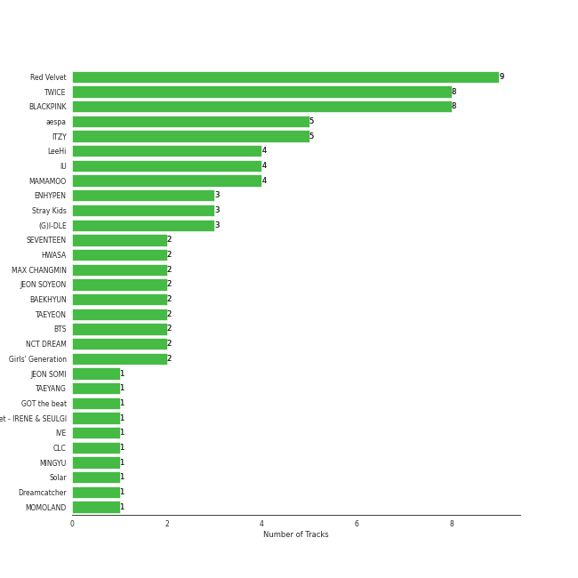
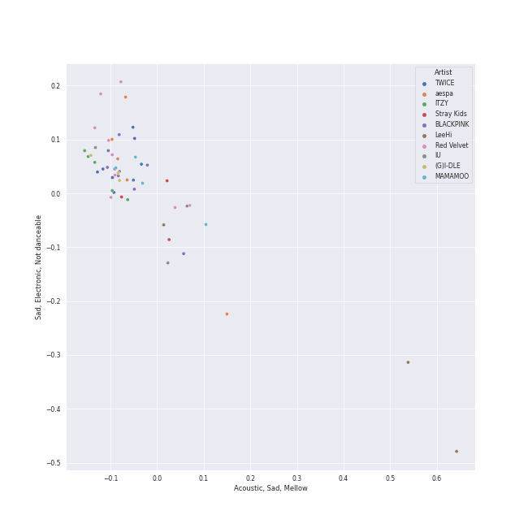
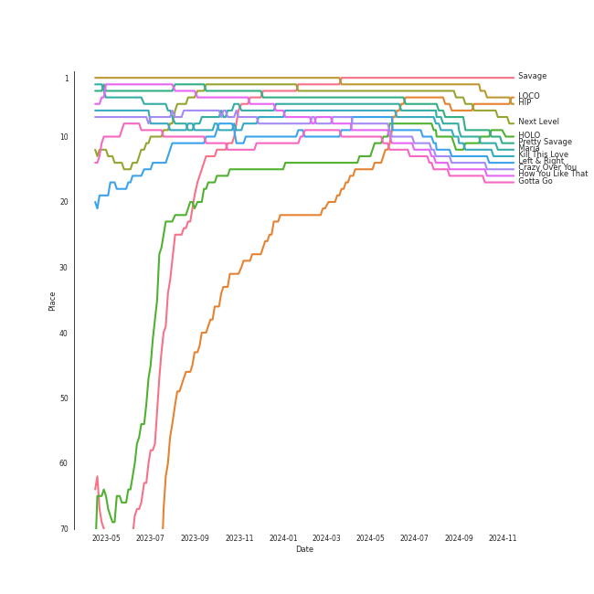
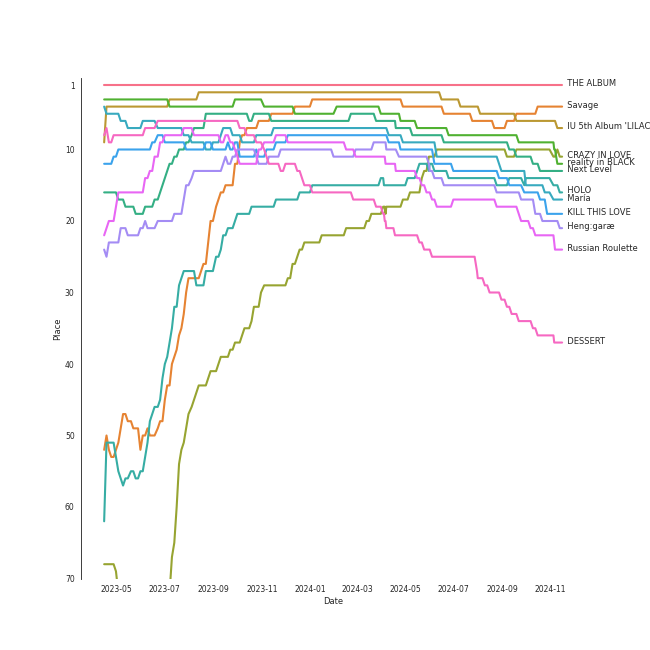
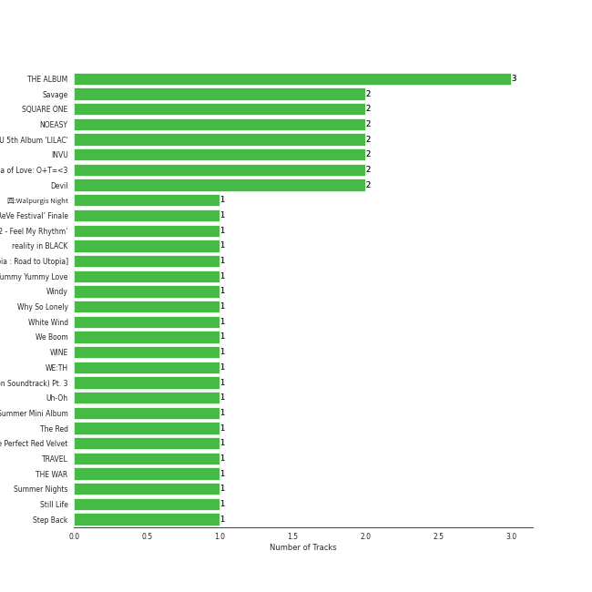
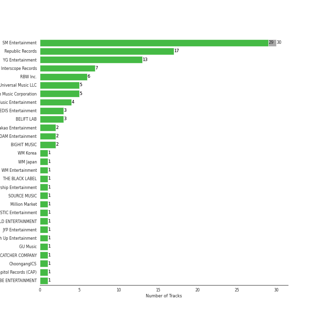
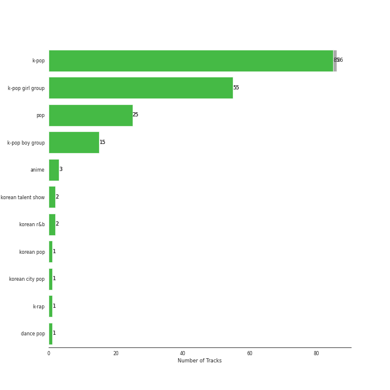
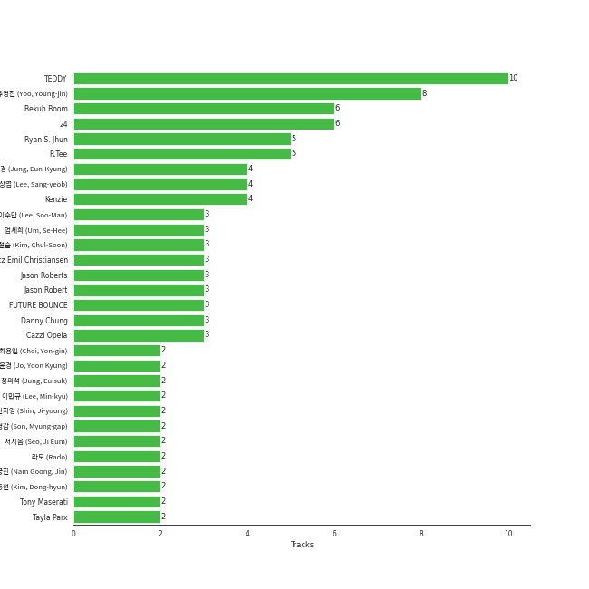
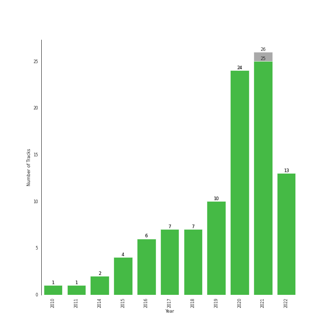

# Your Top Songs 2022

[101 tracks (100 liked) 🔗](https://open.spotify.com/playlist/37i9dQZF1F0sijgNaJdgit)

[See Track Features](audio_features.md)

[See Clusters](clusters/overview.md)

## Top Artists

| Art | Rank | Tracks | 💚 | Artist | 🔗 |
|:---|---:|---:|---:|:---|:---|
|  | 2 | 9 | 9 | [Red Velvet](../../artists/red_velvet/overview.md) | [🔗](https://open.spotify.com/artist/1z4g3DjTBBZKhvAroFlhOM) |
|  | 9 | 8 | 8 | [TWICE](../../artists/twice/overview.md) | [🔗](https://open.spotify.com/artist/7n2Ycct7Beij7Dj7meI4X0) |
|  | 3 | 8 | 8 | [BLACKPINK](../../artists/blackpink/overview.md) | [🔗](https://open.spotify.com/artist/41MozSoPIsD1dJM0CLPjZF) |
|  | 1 | 5 | 5 | [aespa](../../artists/aespa/overview.md) | [🔗](https://open.spotify.com/artist/6YVMFz59CuY7ngCxTxjpxE) |
|  | 5 | 5 | 5 | [ITZY](../../artists/itzy/overview.md) | [🔗](https://open.spotify.com/artist/2KC9Qb60EaY0kW4eH68vr3) |
|  | 11 | 4 | 4 | [LeeHi](../../artists/leehi/overview.md) | [🔗](https://open.spotify.com/artist/7cVZApDoQZpS447nHTsNqu) |
|  | 4 | 4 | 4 | [IU](../../artists/iu/overview.md) | [🔗](https://open.spotify.com/artist/3HqSLMAZ3g3d5poNaI7GOU) |
|  | 13 | 4 | 4 | [MAMAMOO](../../artists/mamamoo/overview.md) | [🔗](https://open.spotify.com/artist/0XATRDCYuuGhk0oE7C0o5G) |
|  | 7 | 3 | 3 | [ENHYPEN](../../artists/enhypen/overview.md) | [🔗](https://open.spotify.com/artist/5t5FqBwTcgKTaWmfEbwQY9) |
|  | 10 | 3 | 3 | [Stray Kids](../../artists/stray_kids/overview.md) | [🔗](https://open.spotify.com/artist/2dIgFjalVxs4ThymZ67YCE) |

See all 58 artists

| Art | Rank | Tracks | 💚 | Artist | 🔗 |
|:---|---:|---:|---:|:---|:---|
|  | 6 | 3 | 3 | [(G)I-DLE](../../artists/(g)i-dle/overview.md) | [🔗](https://open.spotify.com/artist/2AfmfGFbe0A0WsTYm0SDTx) |
|  | 12 | 2 | 2 | [SEVENTEEN](../../artists/seventeen/overview.md) | [🔗](https://open.spotify.com/artist/7nqOGRxlXj7N2JYbgNEjYH) |
|  | 42 | 2 | 2 | [HWASA](../../artists/hwasa/overview.md) | [🔗](https://open.spotify.com/artist/7bmYpVgQub656uNTu6qGNQ) |
|  | 94 | 2 | 2 | MAX CHANGMIN | [🔗](https://open.spotify.com/artist/7FiAkNWMb6ZBYI8tbQLuIS) |
|  | 22 | 2 | 2 | [JEON SOYEON](../../artists/jeon_soyeon/overview.md) | [🔗](https://open.spotify.com/artist/6Xg22wJOAcnvPUfk5WvODH) |
|  | 52 | 2 | 2 | [BAEKHYUN](../../artists/baekhyun/overview.md) | [🔗](https://open.spotify.com/artist/4ufh0WuMZh6y4Dmdnklvdl) |
|  | 8 | 2 | 2 | [TAEYEON](../../artists/taeyeon/overview.md) | [🔗](https://open.spotify.com/artist/3qNVuliS40BLgXGxhdBdqu) |
|  | 27 | 2 | 2 | [BTS](../../artists/bts/overview.md) | [🔗](https://open.spotify.com/artist/3Nrfpe0tUJi4K4DXYWgMUX) |
|  | 24 | 2 | 2 | [NCT DREAM](../../artists/nct_dream/overview.md) | [🔗](https://open.spotify.com/artist/1gBUSTR3TyDdTVFIaQnc02) |
|  | 17 | 2 | 2 | [Girls' Generation](../../artists/girls__generation/overview.md) | [🔗](https://open.spotify.com/artist/0Sadg1vgvaPqGTOjxu0N6c) |
|  | 68 | 1 | 1 | JEON SOMI | [🔗](https://open.spotify.com/artist/7zYj9S9SdIunYCfSm7vzAR) |
|  | 56 | 1 | 1 | TAEYANG | [🔗](https://open.spotify.com/artist/6udveWUgX4vu75FF0DTrXV) |
|  | 31 | 1 | 1 | [GOT the beat](../../artists/got_the_beat/overview.md) | [🔗](https://open.spotify.com/artist/6uNxlIP5lzPFf0BHuELOuX) |
|  | 97 | 1 | 1 | Red Velvet - IRENE & SEULGI | [🔗](https://open.spotify.com/artist/6bwp9ObI8FWvMPCIWVBmhl) |
|  | 18 | 1 | 1 | [IVE](../../artists/ive/overview.md) | [🔗](https://open.spotify.com/artist/6RHTUrRF63xao58xh9FXYJ) |
|  | 60 | 1 | 1 | [CLC](../../artists/clc/overview.md) | [🔗](https://open.spotify.com/artist/6QyO41KctzGc70mVaVnXQO) |
|  | 190 | 1 | 1 | MINGYU | [🔗](https://open.spotify.com/artist/5gUpo0BRmo6EOTbyU3z5Ay) |
|  | 66 | 1 | 1 | [Solar](../../artists/solar/overview.md) | [🔗](https://open.spotify.com/artist/5cYcI546S8Lf97m4mNdYLD) |
|  | 29 | 1 | 1 | [Dreamcatcher](../../artists/dreamcatcher/overview.md) | [🔗](https://open.spotify.com/artist/5V1qsQHdXNm4ZEZHWvFnqQ) |
|  | 271 | 1 | 1 | [MOMOLAND](../../artists/momoland/overview.md) | [🔗](https://open.spotify.com/artist/5RR0MLwcjc87wjSw2JYdwx) |
|  | 402 | 1 | 1 | Kep1er | [🔗](https://open.spotify.com/artist/5R7AMwDeroq6Ls0COQYpS4) |
|  | 75 | 1 | 1 | Suzy | [🔗](https://open.spotify.com/artist/4U80LJd8sG6U9YTFP5izka) |
|  | 172 | 1 | 1 | BIGBANG | [🔗](https://open.spotify.com/artist/4Kxlr1PRlDKEB0ekOCyHgX) |
|  | 191 | 1 | 1 | WONWOO | [🔗](https://open.spotify.com/artist/3rHcBT06Vb1XGVUWhDALZt) |
|  | 55 | 1 | 1 | Loopy | [🔗](https://open.spotify.com/artist/3l9s67pOK4Stw9yW1wr0Bg) |
|  | 100 | 1 | 1 | CHANGMO | [🔗](https://open.spotify.com/artist/3hvinNZRzTLoREmqFiKr1b) |
|  | 170 | 1 | 1 | ROSÉ | [🔗](https://open.spotify.com/artist/3eVa5w3URK5duf6eyVDbu9) |
|  | 20 | 1 | 1 | [EXO](../../artists/exo/overview.md) | [🔗](https://open.spotify.com/artist/3cjEqqelV9zb4BYE3qDQ4O) |
|  | 54 | 1 | 1 | HYO | [🔗](https://open.spotify.com/artist/3U7bOaJLuFkrmDQ1C1OqKl) |
|  | 81 | 1 | 1 | Wonder Girls | [🔗](https://open.spotify.com/artist/3Cv2vi3WTl8VZOTdrBkKdM) |
|  | 59 | 1 | 1 | G-DRAGON | [🔗](https://open.spotify.com/artist/30b9WulBM8sFuBo17nNq9c) |
|  | 338 | 1 | 1 | JAMIE | [🔗](https://open.spotify.com/artist/2YXlVLKq3X3soXd2aXUtIT) |
|  | 14 | 1 | 1 | [CHUNG HA](../../artists/chung_ha/overview.md) | [🔗](https://open.spotify.com/artist/2PSJ6YriU7JsFucxACpU7Y) |
|  | 26 | 1 | 1 | [NMIXX](../../artists/nmixx/overview.md) | [🔗](https://open.spotify.com/artist/28ot3wh4oNmoFOdVajibBl) |
|  | 90 | 1 | 1 | [OH MY GIRL](../../artists/oh_my_girl/overview.md) | [🔗](https://open.spotify.com/artist/2019zR22qK2RBvCqtudBaI) |
|  | 67 | 1 | 1 | [PENTAGON](../../artists/pentagon/overview.md) | [🔗](https://open.spotify.com/artist/1wKpMkucynaTfG8lyPprYV) |
|  | 101 | 1 | 1 | SURAN | [🔗](https://open.spotify.com/artist/1mORehSVEd7lcaT2d7Sl2K) |
|  | 62 | 1 | 1 | 2NE1 | [🔗](https://open.spotify.com/artist/1l0mKo96Jh9HVYONcRl3Yp) |
|  | 410 | 1 | 1 | NATTI NATASHA | [🔗](https://open.spotify.com/artist/1GDbiv3spRmZ1XdM1jQbT7) |
|  | 410 | 1 | 1 | Girl's Day | [🔗](https://open.spotify.com/artist/13kJgvU22LHMsJtGWLmx7W) |
|  | 363 | 1 | 1 | GFRIEND | [🔗](https://open.spotify.com/artist/0qlWcS66ohOIi0M8JZwPft) |
|  | 28 | 1 | 1 | [WENDY](../../artists/wendy/overview.md) | [🔗](https://open.spotify.com/artist/0FRUZvZNPzM3YJMABJxf2K) |
|  | 16 | 1 | 1 | [STAYC](../../artists/stayc/overview.md) | [🔗](https://open.spotify.com/artist/01XYiBYaoMJcNhPokrg0l0) |
|  | 144 | 1 | 0 | TAEYONG | [🔗](https://open.spotify.com/artist/6SKusTjOAPsTZ6kareKQdm) |
|  | 410 | 1 | 0 | YANGYANG | [🔗](https://open.spotify.com/artist/5yyf4YDCKGaa71SC7KRw2L) |
|  | 410 | 1 | 0 | HENDERY | [🔗](https://open.spotify.com/artist/5wrZ59w1ndSBlPeUj2f6Fs) |
|  | 410 | 1 | 0 | JENO | [🔗](https://open.spotify.com/artist/3DZrLuJOQFKqV2sjMsKb1V) |
|  | 410 | 1 | 0 | GISELLE | [🔗](https://open.spotify.com/artist/2P1id80CMwR5R5cwcyIIAi) |

## Top Tracks

Most and least listened tracks

| Rank | ​ | Most listened tracks | Rank | ​​ | Least listened tracks |
|---:|:---|:---|---:|:---|:---|
| 1 |  | [Savage](../../artists/aespa/overview.md) | 900 |  | ZOO |
| 2 |  | [HIP](../../artists/mamamoo/overview.md) | 900 |  | [Dreams Come True](../../artists/aespa/overview.md) |
| 3 |  | [Next Level](../../artists/aespa/overview.md) | 900 |  | [Butter](../../artists/bts/overview.md) |
| 4 |  | [LOCO](../../artists/itzy/overview.md) | 900 |  | Fever |
| 5 |  | [Pretty Savage](../../artists/blackpink/overview.md) | 900 |  | [Breakthrough](../../artists/twice/overview.md) |
| 6 |  | [Maria](../../artists/hwasa/overview.md) | 900 |  | [Yummy Yummy Love](../../artists/momoland/overview.md) |
| 7 |  | [Kill This Love](../../artists/blackpink/overview.md) | 900 |  | WA DA DA |
| 8 |  | [HOLO](../../artists/leehi/overview.md) | 900 |  | [As If It's Your Last](../../artists/blackpink/overview.md) |
| 10 |  | [Left & Right](../../artists/seventeen/overview.md) | 900 |  | MAGO |
| 11 |  | [Crazy Over You](../../artists/blackpink/overview.md) | 900 |  | [O.O](../../artists/nmixx/overview.md) |

## Top Albums

| Art | Rank | Tracks | 💚 | Album | Release Date | 🔗 |
|:---|---:|---:|---:|:---|:---|:---|
|  | 1 | 3 | 3 | THE ALBUM | 2020-10-02 | [🔗](https://open.spotify.com/album/71O60S5gIJSIAhdnrDIh3N) |
|  | 5 | 2 | 2 | Savage - The 1st Mini Album | 2021-10-05 | [🔗](https://open.spotify.com/album/3vyyDkvYWC36DwgZCYd3Wu) |
|  | 88 | 2 | 2 | SQUARE ONE | 2016-08-08 | [🔗](https://open.spotify.com/album/0FOOodYRlj7gzh7q7IjmNZ) |
|  | 30 | 2 | 2 | NOEASY | 2021-08-23 | [🔗](https://open.spotify.com/album/558tpdCejjVQNFAumRAeQj) |
|  | 4 | 2 | 2 | IU 5th Album 'LILAC' | 2021-03-25 | [🔗](https://open.spotify.com/album/01dPJcwyht77brL4JQiR8R) |
|  | 40 | 2 | 2 | INVU - The 3rd Album | 2022-02-14 | [🔗](https://open.spotify.com/album/7i2YLTVQ0dyngRuUqtGmr9) |
|  | 122 | 2 | 2 | Formula of Love: O+T=<3 | 2021-11-12 | [🔗](https://open.spotify.com/album/5052Ip89wdW8EGdpjEpNeq) |
|  | 160 | 2 | 2 | Devil - The 2nd Mini Album | 2022-01-13 | [🔗](https://open.spotify.com/album/6bG2rY8NzT7dIzUNADDNCR) |
|  | 603 | 1 | 1 | 回:Walpurgis Night | 2020-11-09 | [🔗](https://open.spotify.com/album/6keRNtq7CnhNrD2EIKOA6h) |
|  | 144 | 1 | 1 | ‘The ReVe Festival’ Finale | 2019-12-23 | [🔗](https://open.spotify.com/album/3rVtm00UfbuzWOewdm4iYM) |

See all 92 albums

| Art | Rank | Tracks | 💚 | Album | Release Date | 🔗 |
|:---|---:|---:|---:|:---|:---|:---|
|  | 77 | 1 | 1 | ‘The ReVe Festival 2022 - Feel My Rhythm’ | 2022-03-21 | [🔗](https://open.spotify.com/album/3HgoCO9wWuPcNhz8Ip4C46) |
|  | 8 | 1 | 1 | reality in BLACK | 2019-11-14 | [🔗](https://open.spotify.com/album/7CucpzwxAZ6kHmctI9eo4X) |
|  | 391 | 1 | 1 | [Dystopia : Road to Utopia] | 2021-01-26 | [🔗](https://open.spotify.com/album/1EyLcB9R1KfUV45AxtRR3V) |
|  | 603 | 1 | 1 | Yummy Yummy Love | 2022-01-14 | [🔗](https://open.spotify.com/album/2r35RHvEtBjgKiONdItRR5) |
|  | 19 | 1 | 1 | Windy | 2021-07-05 | [🔗](https://open.spotify.com/album/1lv92CIVZbB2BsHmIx7qJf) |
|  | 603 | 1 | 1 | Why So Lonely | 2016-07-05 | [🔗](https://open.spotify.com/album/2TzaSJlsVyKcZ0NOf2TI9U) |
|  | 348 | 1 | 1 | White Wind | 2019-03-14 | [🔗](https://open.spotify.com/album/60m09rutmwj5ewOJoFIAVY) |
|  | 41 | 1 | 1 | We Boom - The 3rd Mini Album | 2019-07-26 | [🔗](https://open.spotify.com/album/31ln9LpD1WyhFlOvDp9YJc) |
|  | 108 | 1 | 1 | WINE | 2017-04-27 | [🔗](https://open.spotify.com/album/26adxLsliyYcCfVTF6xA75) |
|  | 138 | 1 | 1 | WE:TH | 2020-10-12 | [🔗](https://open.spotify.com/album/1ASYbBYBwV6Rcfc2ycqmlK) |
|  | 75 | 1 | 1 | VINCENZO (Original Television Soundtrack) Pt. 3 | 2021-03-14 | [🔗](https://open.spotify.com/album/47ulDGfVUWUcUSWRQCzxr3) |
|  | 46 | 1 | 1 | Uh-Oh | 2019-06-26 | [🔗](https://open.spotify.com/album/3PzrNuMGWGpp8WOfrmpkaU) |
|  | 497 | 1 | 1 | The Red Summer - Summer Mini Album | 2017-07-09 | [🔗](https://open.spotify.com/album/6OXg149IkmbgW7zfzbwgS2) |
|  | 36 | 1 | 1 | The Red - The 1st Album | 2015-09-09 | [🔗](https://open.spotify.com/album/6YL9J0E6PGtYzkhyMxnmXd) |
|  | 17 | 1 | 1 | The Perfect Red Velvet - The 2nd Album Repackage | 2018-01-29 | [🔗](https://open.spotify.com/album/0OkJThJls8FO1lutMzMDJ0) |
|  | 133 | 1 | 1 | TRAVEL | 2020-11-03 | [🔗](https://open.spotify.com/album/3xje7wSW2xwQx2GNJ5cfNu) |
|  | 110 | 1 | 1 | THE WAR - The 4th Album | 2017-07-18 | [🔗](https://open.spotify.com/album/53pJcIJBdlm5rhVhjSnvHn) |
|  | 125 | 1 | 1 | Summer Nights | 2018-07-09 | [🔗](https://open.spotify.com/album/2GKTroaa4ysyhEdvzpvUoM) |
|  | 567 | 1 | 1 | Still Life | 2022-04-05 | [🔗](https://open.spotify.com/album/2oCAY48bhZvQte0l7apmYC) |
|  | 451 | 1 | 1 | Step Back | 2022-01-03 | [🔗](https://open.spotify.com/album/3gwL04bGAX4Kc2D5Wd7NMk) |
|  | 187 | 1 | 1 | Star To A Young Culture | 2020-11-12 | [🔗](https://open.spotify.com/album/4PrRd0lIunUEiiE5rbZklR) |
|  | 71 | 1 | 1 | SQUARE UP | 2018-06-15 | [🔗](https://open.spotify.com/album/0wOiWrujRbxlKEGWRQpKYc) |
|  | 124 | 1 | 1 | SEOULITE | 2016-03-09 | [🔗](https://open.spotify.com/album/2c41Flo2HQgy0A9P3xuSFf) |
|  | 18 | 1 | 1 | Russian Roulette - The 3rd Mini Album | 2016-09-07 | [🔗](https://open.spotify.com/album/6MNlcai3skKLKv5syzFwC3) |
|  | 56 | 1 | 1 | Run Devil Run - The 2nd Album Repackage | 2010-03-22 | [🔗](https://open.spotify.com/album/2b4JQKXl0gwf3bnAfhZwLA) |
|  | 57 | 1 | 1 | RISE | 2014-06-03 | [🔗](https://open.spotify.com/album/1Y9so4jq4t4taAHu0VdKX3) |
|  | 603 | 1 | 1 | RED MOON | 2018-07-16 | [🔗](https://open.spotify.com/album/3vlnS8olJIlCACkLBbHYP2) |
|  | 101 | 1 | 1 | RBB - The 5th Mini Album | 2018-11-30 | [🔗](https://open.spotify.com/album/7rNIvLwIpB2mwOzk20iqIl) |
|  | 188 | 1 | 1 | R | 2021-03-12 | [🔗](https://open.spotify.com/album/5BQcoDfcZ8aBcikYX9B7Ob) |
|  | 465 | 1 | 1 | Proof | 2022-06-10 | [🔗](https://open.spotify.com/album/6al2VdKbb6FIz9d7lU7WRB) |
|  | 523 | 1 | 1 | Pity Party | 2022-02-03 | [🔗](https://open.spotify.com/album/2yMHiLYBnrMsdUCUL3bFkU) |
|  | 180 | 1 | 1 | Perfect Velvet - The 2nd Album | 2017-11-17 | [🔗](https://open.spotify.com/album/0rvrbZvaDX5S9ZBhwOwFfH) |
|  | 231 | 1 | 1 | Not Shy | 2020-08-17 | [🔗](https://open.spotify.com/album/5NN55LKbjzX16a7Uf8u7Os) |
|  | 9 | 1 | 1 | Next Level | 2021-05-17 | [🔗](https://open.spotify.com/album/2CzbrboOLzeRoaaH1N5K0N) |
|  | 163 | 1 | 1 | Naughty | 2020-07-20 | [🔗](https://open.spotify.com/album/2lkUE2gkw5sX0fGzZZCs0N) |
|  | 131 | 1 | 1 | NONSTOP | 2020-04-27 | [🔗](https://open.spotify.com/album/7J8Kp48L7RdLkpjSVrO5PY) |
|  | 134 | 1 | 1 | Merry & Happy | 2017-12-11 | [🔗](https://open.spotify.com/album/0R7pj4tnmcoUulrZGPo6nw) |
|  | 11 | 1 | 1 | María | 2020-06-29 | [🔗](https://open.spotify.com/album/5YYY7QCkq3pSw4Hoc1m0D3) |
|  | 603 | 1 | 1 | MAP OF THE SOUL : 7 | 2020-02-21 | [🔗](https://open.spotify.com/album/5W1XY5ucNATjTULERvXx9j) |
|  | 79 | 1 | 1 | Lion Heart - The 5th Album | 2015-08-19 | [🔗](https://open.spotify.com/album/4eKdn0skJCidO2wqIJyCgB) |
|  | 20 | 1 | 1 | Like Water - The 1st Mini Album | 2021-04-05 | [🔗](https://open.spotify.com/album/1Ao5vWPO13f4l0ldwxOKL7) |
|  | 286 | 1 | 1 | Last Fantasy | 2011-11-29 | [🔗](https://open.spotify.com/album/149BHv6qAyMgJ483vPi77C) |
|  | 35 | 1 | 1 | KWON JI YONG | 2017-06-08 | [🔗](https://open.spotify.com/album/2koSNfchdUxqw1rPJO87aH) |
|  | 12 | 1 | 1 | KILL THIS LOVE | 2019-04-05 | [🔗](https://open.spotify.com/album/3PNxZ3BELbUXJ1XLktXiHz) |
|  | 55 | 1 | 1 | Ice Cream Cake - The 1st Mini Album | 2015-03-17 | [🔗](https://open.spotify.com/album/27cBQ5FDqv0xLgiJ7qNpZr) |
|  | 524 | 1 | 1 | IT'z ME | 2020-03-09 | [🔗](https://open.spotify.com/album/7ynKAohxfwPUZzvU8f1p1U) |
|  | 603 | 1 | 1 | IT'z ICY | 2019-07-29 | [🔗](https://open.spotify.com/album/5Xb03XAF2LoaMqbM38H9eB) |
|  | 127 | 1 | 1 | IN LIFE | 2020-09-14 | [🔗](https://open.spotify.com/album/0aERWcI2KYSCM4biUihB9X) |
|  | 34 | 1 | 1 | I trust | 2020-04-06 | [🔗](https://open.spotify.com/album/57sl8AvqVqm4Fadre0z8FQ) |
|  | 33 | 1 | 1 | I am | 2018-05-02 | [🔗](https://open.spotify.com/album/1GtPnOiHxCnoZPCiLcKj22) |
|  | 44 | 1 | 1 | I Am The Best | 2014-12-09 | [🔗](https://open.spotify.com/album/7zjLDZzHo2XgvYwpuNwEvK) |
|  | 375 | 1 | 1 | Hot Sauce - The 1st Album | 2021-05-10 | [🔗](https://open.spotify.com/album/1miTgxRTUje9Jqml1aOSUi) |
|  | 15 | 1 | 1 | Heng:garæ | 2020-06-22 | [🔗](https://open.spotify.com/album/3q6lN3kfsDgGaQUC7kVASH) |
|  | 14 | 1 | 1 | HOLO | 2020-07-23 | [🔗](https://open.spotify.com/album/5xq9sm0jGMMDu5LifpBBo1) |
|  | 69 | 1 | 1 | HELICOPTER | 2020-09-02 | [🔗](https://open.spotify.com/album/1uwfxRAhW1hxclCVkzku8d) |
|  | 603 | 1 | 1 | Guilty Pleasure | 2021-11-24 | [🔗](https://open.spotify.com/album/7jke1vYOze3jdyTiWhtFnz) |
|  | 16 | 1 | 1 | Gotta Go | 2019-01-02 | [🔗](https://open.spotify.com/album/3WgHekDElv10Kam9aCMwnx) |
|  | 603 | 1 | 1 | Girl's Day Love Second Album | 2015-07-07 | [🔗](https://open.spotify.com/album/6bf0r561nSUanYZ9ej56Me) |
|  | 186 | 1 | 1 | GUESS WHO | 2021-04-30 | [🔗](https://open.spotify.com/album/4lS8nhX8cplsYPzKjvhw6G) |
|  | 603 | 1 | 1 | FIRST IMPACT | 2022-01-03 | [🔗](https://open.spotify.com/album/7pHyAucSgWoDNlFHfhQfVN) |
|  | 199 | 1 | 1 | FANCY YOU | 2019-04-22 | [🔗](https://open.spotify.com/album/3aLpWFejbsdyafODLXRqwF) |
|  | 27 | 1 | 1 | Eyes Wide Open | 2020-10-26 | [🔗](https://open.spotify.com/album/33jypnU7WULxPaVrjj4RXH) |
|  | 332 | 1 | 1 | ELEVEN | 2021-12-01 | [🔗](https://open.spotify.com/album/1XMYvsHRt52sMi6wittWqI) |
|  | 603 | 1 | 1 | Dreams Come True - SM STATION | 2021-12-20 | [🔗](https://open.spotify.com/album/4Jzx0XAORPKQ3v7EaL8Ful) |
|  | 73 | 1 | 1 | Dream | 2016-01-07 | [🔗](https://open.spotify.com/album/7ciJtZ2tYXhKsndQ7bf7Vw) |
|  | 67 | 1 | 1 | DUMB DUMB | 2021-08-02 | [🔗](https://open.spotify.com/album/24sFioeGsPtxa5fD6VzL8b) |
|  | 109 | 1 | 1 | DIMENSION : DILEMMA | 2021-10-12 | [🔗](https://open.spotify.com/album/5jGRqioNCSWZGBl3QmyuFI) |
|  | 120 | 1 | 1 | DIMENSION : ANSWER | 2022-01-10 | [🔗](https://open.spotify.com/album/3nOj9hsnptBEDt9ie2lra5) |
|  | 24 | 1 | 1 | DESSERT | 2020-07-22 | [🔗](https://open.spotify.com/album/5brSFD1knAOSM7j6083naD) |
|  | 204 | 1 | 1 | CRY FOR ME | 2020-12-18 | [🔗](https://open.spotify.com/album/2aRAPmBCEdo9pWimsI5l87) |
|  | 10 | 1 | 1 | CRAZY IN LOVE | 2021-09-24 | [🔗](https://open.spotify.com/album/4U7rGOkJgtxs27H9L93Xli) |
|  | 603 | 1 | 1 | Breakthrough | 2019-06-12 | [🔗](https://open.spotify.com/album/7LWfEiSeue9BXPbUOH34q6) |
|  | 29 | 1 | 1 | Black Mamba | 2020-11-17 | [🔗](https://open.spotify.com/album/3syEYrKIsgxaZMB5t1dVG7) |
|  | 217 | 1 | 1 | Bittersweet (feat. LeeHi) | 2021-05-28 | [🔗](https://open.spotify.com/album/6qVk855QPCh57noNeeHMXQ) |
|  | 159 | 1 | 1 | BORDER : CARNIVAL | 2021-04-26 | [🔗](https://open.spotify.com/album/4LGYBcRsteiXjcPD4QQvxv) |
|  | 23 | 1 | 1 | BBIBBI | 2018-10-10 | [🔗](https://open.spotify.com/album/4ghBzVOTFoeKPPmyNKjVtI) |
|  | 603 | 1 | 1 | As If It's Your Last | 2017-06-22 | [🔗](https://open.spotify.com/album/7ikmjsvRzDRzxHN0KXSQdv) |
|  | 49 | 1 | 1 | Amusement Park | 2020-12-21 | [🔗](https://open.spotify.com/album/1azcqabc4kDgRNMWFA02wZ) |
|  | 213 | 1 | 1 | AD MARE | 2022-02-22 | [🔗](https://open.spotify.com/album/2QbA97qjlAs81t6kVS6zBk) |
|  | 84 | 1 | 1 | ; [Semicolon] | 2020-10-19 | [🔗](https://open.spotify.com/album/1EMYSiKKTSKLZrOC2nTStL) |
|  | 59 | 1 | 1 | 4 ONLY | 2021-09-09 | [🔗](https://open.spotify.com/album/1DKgZeAYrjslAPZVMe6EFt) |
|  | 603 | 1 | 0 | 2021 Winter SMTOWN : SMCU EXPRESS | 2021-12-27 | [🔗](https://open.spotify.com/album/3dn2in6doTc6zfA0G2UFDZ) |

## Top Record Labels

| Tracks | 💚 | Label |
|---:|---:|:---|
| 30 | 29 | [SM Entertainment](../../labels/sm_entertainment/overview.md) |
| 17 | 17 | [Republic Records](../../labels/republic_records/overview.md) |
| 13 | 13 | [YG Entertainment](../../labels/yg_entertainment/overview.md) |
| 7 | 7 | [Interscope Records](../../labels/interscope_records/overview.md) |
| 6 | 6 | [RBW Inc.](../../labels/rbw_inc_/overview.md) |
| 5 | 5 | [Universal Music LLC](../../labels/universal_music_llc/overview.md) |
| 5 | 5 | [Genie Music Corporation](../../labels/genie_music_corporation/overview.md) |
| 4 | 4 | [Stone Music Entertainment](../../labels/stone_music_entertainment/overview.md) |
| 3 | 3 | [PLEDIS Entertainment](../../labels/pledis_entertainment/overview.md) |
| 3 | 3 | [BELIFT LAB](../../labels/belift_lab/overview.md) |

See all 29 labels

| Tracks | 💚 | Label |
|---:|---:|:---|
| 2 | 2 | [Kakao Entertainment](../../labels/kakao_entertainment/overview.md) |
| 2 | 2 | [EDAM Entertainment](../../labels/edam_entertainment/overview.md) |
| 2 | 2 | [BIGHIT MUSIC](../../labels/bighit_music/overview.md) |
| 1 | 1 | [WM Korea](../../labels/wm_korea/overview.md) |
| 1 | 1 | [WM Japan](../../labels/wm_japan/overview.md) |
| 1 | 1 | [WM Entertainment](../../labels/wm_entertainment/overview.md) |
| 1 | 1 | THE BLACK LABEL |
| 1 | 1 | [Starship Entertainment](../../labels/starship_entertainment/overview.md) |
| 1 | 1 | [SOURCE MUSIC](../../labels/source_music/overview.md) |
| 1 | 1 | Million Market |
| 1 | 1 | MYSTIC Entertainment |
| 1 | 1 | MLD ENTERTAINMENT |
| 1 | 1 | [JYP Entertainment](../../labels/jyp_entertainment/overview.md) |
| 1 | 1 | [High Up Entertainment](../../labels/high_up_entertainment/overview.md) |
| 1 | 1 | GU Music |
| 1 | 1 | [DREAMCATCHER COMPANY](../../labels/dreamcatcher_company/overview.md) |
| 1 | 1 | ChoongangICS |
| 1 | 1 | Capitol Records (CAP) |
| 1 | 1 | [CUBE ENTERTAINMENT](../../labels/cube_entertainment/overview.md) |

## Genres

| Tracks | 💚 | Genre |
|---:|---:|:---|
| 88 | 87 | [k-pop](../../genres/k-pop/overview.md) |
| 55 | 55 | [k-pop girl group](../../genres/k-pop_girl_group/overview.md) |
| 25 | 25 | [pop](../../genres/pop/overview.md) |
| 15 | 15 | [k-pop boy group](../../genres/k-pop_boy_group/overview.md) |
| 3 | 3 | [anime](../../genres/anime/overview.md) |
| 2 | 2 | korean talent show |
| 2 | 2 | [korean r&b](../../genres/korean_r_b/overview.md) |
| 1 | 1 | [korean pop](../../genres/korean_pop/overview.md) |
| 1 | 1 | korean city pop |
| 1 | 1 | [k-rap](../../genres/k-rap/overview.md) |

See all 11 genres

| Tracks | 💚 | Genre |
|---:|---:|:---|
| 1 | 1 | [dance pop](../../genres/dance_pop/overview.md) |

## Top Producers

| Art | Producer | Tracks | Credit Types |
|:---|:---|---:|:---|
| | [TEDDY](../../producers/teddy/overview.md) | 10 | Arranger, Lyricist, Producer, Songwriter |
| | [유영진 (Yoo, Young-jin)](../../producers/유영진_(yoo,_young-jin)/overview.md) | 8 | Arranger, Lyricist, Producer, Songwriter |
|  | Bekuh Boom | 6 | Lyricist, Songwriter |
| | [24](../../producers/24/overview.md) | 6 | Arranger, Songwriter, Producer |
| | [R.Tee](../../producers/r_tee/overview.md) | 5 | Arranger, Songwriter, Producer |
| | [Ryan S. Jhun](../../producers/ryan_s__jhun/overview.md) | 5 | Arranger, Songwriter |
| | 이상엽 (Lee, Sang-yeob) | 4 | Producer |
| | [정은경 (Jung, Eun-Kyung)](../../producers/정은경_(jung,_eun-kyung)/overview.md) | 4 | Producer |
| | [Kenzie](../../producers/kenzie/overview.md) | 4 | Songwriter, Arranger, Lyricist |
| | Lauritz Emil Christiansen | 3 | Arranger, Songwriter |

View all

| Art | Producer | Tracks | Credit Types |
|:---|:---|---:|:---|
| | FUTURE BOUNCE | 3 | Arranger, Songwriter |
| | Jason Roberts | 3 | Producer |
| | Jason Robert | 3 | Producer |
| | [엄세희 (Um, Se-Hee)](../../producers/엄세희_(um,_se-hee)/overview.md) | 3 | Producer |
| | Cazzi Opeia | 3 | Songwriter, Lyricist |
| | 김철순 (Kim, Chul-Soon) | 3 | Producer |
| | Danny Chung | 3 | Lyricist |
| | [이수만 (Lee, Soo-Man)](../../producers/이수만_(lee,_soo-man)/overview.md) | 3 | Producer |
| | Ellen Berg Tollbom | 2 | Songwriter, Lyricist |
| | 손명갑 (Son, Myung-gap) | 2 | Producer |
| | Cutfather | 2 | Songwriter, Arranger |
| | Jonatan Gusmark | 2 | Lyricist, Songwriter |
| | Tayla Parx | 2 | Songwriter, Arranger |
| | 남궁진 (Nam Goong, Jin) | 2 | Producer |
|  | [JEON SOYEON](../../artists/jeon_soyeon/overview.md) | 2 | Arranger, Lyricist, Songwriter |
| | Dr.JO | 2 | Lyricist, Songwriter |
| | Jeppe London Bilsby | 2 | Arranger, Songwriter |
| | [서지음 (Seo, Ji Eum)](../../producers/서지음_(seo,_ji_eum)/overview.md) | 2 | Lyricist |
| | 신지영 (Shin, Ji-young) | 2 | Producer |
| | 최용인 (Choi, Yon-gin) | 2 | Producer |
|  | RM | 2 | Songwriter |
|  | [IU](../../artists/iu/overview.md) | 2 | Lyricist, Songwriter |
| | [Tony Maserati](../../producers/tony_maserati/overview.md) | 2 | Producer |
| | [조윤경 (Jo, Yoon Kyung)](../../producers/조윤경_(jo,_yoon_kyung)/overview.md) | 2 | Lyricist |
|  | [HWASA](../../artists/hwasa/overview.md) | 2 | Lyricist, Songwriter |
| | 김동현 (Kim, Dong-hyun) | 2 | Lyricist |
| | Celine Svanbäck (Svanbäck, Celine) | 2 | Arranger, Songwriter |
| | Sophia Pae | 2 | Arranger |
| | EJAE | 2 | Songwriter |
| | 정의석 (Jung, Euisuk) | 2 | Producer |
| | 이민규 (Lee, Min-kyu) | 2 | Producer |
| | Ludvig Carl Evers | 2 | Lyricist, Songwriter |
|  | J.Y. Park | 2 | Lyricist, Arranger, Songwriter |
| | [라도 (Rado)](../../producers/라도_(rado)/overview.md) | 2 | Lyricist, Songwriter, Arranger |
| | Boy Matthews | 1 | Lyricist |
| | Mich Hansen | 1 | Songwriter |
| | Hayley Aitken | 1 | Arranger, Songwriter |
| | Poptime | 1 | Arranger, Songwriter |
| | Chanti | 1 | Songwriter |
| | [Arschtritt Lindgren](../../producers/arschtritt_lindgren/overview.md) | 1 | Producer, Songwriter |
| | Joyfactory | 1 | Lyricist |
| | 이우민 (Yiwoomin) | 1 | Arranger, Lyricist, Producer, Songwriter |
| | 노민지 (Noh, Min-ji) | 1 | Producer |
| | [이민수 (이민수)](../../producers/이민수_(이민수)/overview.md) | 1 | Songwriter |
| | N!ko | 1 | Arranger, Songwriter |
| | 김정미 (Kim Jung-mi) | 1 | Lyricist |
| | LØREN (LOREN) | 1 | Lyricist |
| | Risto Asikainen | 1 | Songwriter |
| | Daniel Mikael Caesar | 1 | Songwriter |
| | Brother Su | 1 | Lyricist |
| | Cameron Neilson | 1 | Songwriter |
|  | MAX CHANGMIN | 1 | Lyricist |
| | Hautboi Rich | 1 | Songwriter |
| | 전부연 (Jeon, Bu-yeon) | 1 | Producer |
| | MooF | 1 | Arranger, Songwriter |
| | Ray McCullough | 1 | Lyricist, Songwriter |
| | Nmore | 1 | Arranger, Songwriter |
| | Rob Grimaldi | 1 | Songwriter |
|  | VERNON | 1 | Lyricist |
| | 밍지션 (Ming, Jisyeon) | 1 | Producer |
| | Alex Bilowitz | 1 | Songwriter |
| | 최혜진 (Cho, Hye-jin) | 1 | Producer |
| | Markus Lindell | 1 | Arranger, Songwriter |
| | 김다현 (Kim, Da-hyun) | 1 | Lyricist |
| | Sean Alexander | 1 | Songwriter |
| | [블랙아이드필승 (Black Eyed Pilseung)](../../producers/블랙아이드필승_(black_eyed_pilseung)/overview.md) | 1 | Lyricist, Songwriter |
| | [LDN Noise](../../producers/ldn_noise/overview.md) | 1 | Arranger, Producer, Songwriter |
| | SENDO | 1 | Producer |
| | Kirsten Collins | 1 | Songwriter |
| | Avenue 52 | 1 | Arranger |
| | 바다 (Bada) | 1 | Lyricist |
|  | [BoA](../../artists/boa/overview.md) | 1 | Arranger, Lyricist, Songwriter |
| | Alexander Holmgren | 1 | Arranger, Songwriter |
| | 이기 (IGGY) | 1 | Arranger, Songwriter |
| | [구종필 (Koo, Jong-Pil)](../../producers/구종필_(koo,_jong-pil)/overview.md) | 1 | Producer |
| | Sophie Curtis | 1 | Songwriter |
| | 정유라 (Jeong, Yu-ra) | 1 | Producer |
| | 승관 (SEUNGKWAN) | 1 | Lyricist |
| | Max Seaberg | 1 | Producer |
| | 이주형 (Lee, Juhyeong) | 1 | Producer |
| | Rachel Furner | 1 | Songwriter |
| | Brooke Tomlinson | 1 | Songwriter |
| | SAAY | 1 | Lyricist, Songwriter |
| | Gustav Landell | 1 | Arranger, Lyricist, Songwriter |
| | Ray Romulus | 1 | Lyricist, Songwriter |
| | Alma Goodman | 1 | Songwriter |
| | 고현정 (Go, Hyeon-Jeong) | 1 | Producer |
| | Kako | 1 | Songwriter |
| | DJ Riggins | 1 | Producer |
| | 홍승성 (Hong, Seung-sung) | 1 | Producer |

## Years

View all years

| Year | Number of Tracks |
|:---|---:|
| 2022 | 13 |
| [2021](2021/overview.md) | 26 |
| [2020](2020/overview.md) | 24 |
| 2019 | 10 |
| 2018 | 7 |
| 2017 | 7 |
| 2016 | 6 |
| 2015 | 4 |
| 2014 | 2 |
| 2011 | 1 |
| 2010 | 1 |

| ​ | 10 newest albums | ​​ | 10 oldest albums |
|:---|:---|:---|:---|
|  | Proof (2022-06-10) |  | Run Devil Run - The 2nd Album Repackage (2010-03-22) |
|  | Still Life (2022-04-05) |  | Last Fantasy (2011-11-29) |
|  | ‘The ReVe Festival 2022 - Feel My Rhythm’ (2022-03-21) |  | RISE (2014-06-03) |
|  | AD MARE (2022-02-22) |  | I Am The Best (2014-12-09) |
|  | INVU - The 3rd Album (2022-02-14) |  | Ice Cream Cake - The 1st Mini Album (2015-03-17) |
|  | Pity Party (2022-02-03) |  | Girl's Day Love Second Album (2015-07-07) |
|  | Yummy Yummy Love (2022-01-14) |  | Lion Heart - The 5th Album (2015-08-19) |
|  | Devil - The 2nd Mini Album (2022-01-13) |  | The Red - The 1st Album (2015-09-09) |
|  | DIMENSION : ANSWER (2022-01-10) |  | Dream (2016-01-07) |
|  | Step Back (2022-01-03) |  | SEOULITE (2016-03-09) |