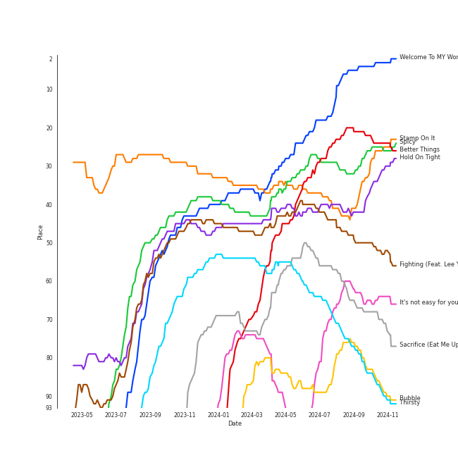

# Tracks in Your Top Songs 2023 from 2023

## Artists

| Art | Rank | Tracks | 💚 | Artist | 🔗 |
|:---|---:|---:|---:|:---|:---|
|  | 1 | 7 | 7 | [aespa](../../../artists/aespa/overview.md) | [🔗](https://open.spotify.com/artist/6YVMFz59CuY7ngCxTxjpxE) |
|  | 9 | 4 | 4 | [TWICE](../../../artists/twice/overview.md) | [🔗](https://open.spotify.com/artist/7n2Ycct7Beij7Dj7meI4X0) |
|  | 7 | 3 | 3 | [ENHYPEN](../../../artists/enhypen/overview.md) | [🔗](https://open.spotify.com/artist/5t5FqBwTcgKTaWmfEbwQY9) |
|  | 5 | 3 | 3 | [ITZY](../../../artists/itzy/overview.md) | [🔗](https://open.spotify.com/artist/2KC9Qb60EaY0kW4eH68vr3) |
|  | 31 | 2 | 2 | [GOT the beat](../../../artists/got_the_beat/overview.md) | [🔗](https://open.spotify.com/artist/6uNxlIP5lzPFf0BHuELOuX) |
|  | 20 | 2 | 2 | [Billlie](../../../artists/billlie/overview.md) | [🔗](https://open.spotify.com/artist/2GQxKDojobwBjZMPf7aoh0) |
|  | 15 | 2 | 1 | [LE SSERAFIM](../../../artists/le_sserafim/overview.md) | [🔗](https://open.spotify.com/artist/4SpbR6yFEvexJuaBpgAU5p) |
|  | 284 | 1 | 1 | JISOO | [🔗](https://open.spotify.com/artist/6UZ0ba50XreR4TM8u322gs) |
|  | 18 | 1 | 1 | [IVE](../../../artists/ive/overview.md) | [🔗](https://open.spotify.com/artist/6RHTUrRF63xao58xh9FXYJ) |
|  | 23 | 1 | 1 | [NewJeans](../../../artists/newjeans/overview.md) | [🔗](https://open.spotify.com/artist/6HvZYsbFfjnjFrWF950C9d) |

View all

| Art | Rank | Tracks | 💚 | Artist | 🔗 |
|:---|---:|---:|---:|:---|:---|
|  | 130 | 1 | 1 | EPEX | [🔗](https://open.spotify.com/artist/4e2umhzNHTSeQnSCWPN0uT) |
|  | 180 | 1 | 1 | MONSTA X | [🔗](https://open.spotify.com/artist/4TnGh5PKbSjpYqpIdlW5nz) |
|  | 113 | 1 | 1 | Nile Rodgers | [🔗](https://open.spotify.com/artist/3yDIp0kaq9EFKe07X1X2rz) |
|  | 6 | 1 | 1 | [(G)I-DLE](../../../artists/(g)i-dle/overview.md) | [🔗](https://open.spotify.com/artist/2AfmfGFbe0A0WsTYm0SDTx) |
|  | 27 | 1 | 1 | [NMIXX](../../../artists/nmixx/overview.md) | [🔗](https://open.spotify.com/artist/28ot3wh4oNmoFOdVajibBl) |
|  | 48 | 1 | 1 | nævis | [🔗](https://open.spotify.com/artist/2067CjQ2nC56cRZX8goeHg) |
|  | 64 | 1 | 1 | BSS | [🔗](https://open.spotify.com/artist/1uAT5bTSp6dWbNmixIUP5t) |
|  | 63 | 1 | 1 | Lee Young Ji | [🔗](https://open.spotify.com/artist/0Y2AcMPMpeuPXtPQGVvRBq) |
|  | 43 | 1 | 1 | MISAMO | [🔗](https://open.spotify.com/artist/0IwZVmMMGE7nNXS7vN9SIo) |
|  | 118 | 1 | 1 | [THE BOYZ](../../../artists/the_boyz/overview.md) | [🔗](https://open.spotify.com/artist/0CmvFWTX9zmMNCUi6fHtAx) |
|  | 17 | 1 | 1 | [STAYC](../../../artists/stayc/overview.md) | [🔗](https://open.spotify.com/artist/01XYiBYaoMJcNhPokrg0l0) |
|  | 75 | 1 | 0 | JIHYO | [🔗](https://open.spotify.com/artist/7F1iAHRYxR3MY7yAEuFqgL) |

## Albums

| Art | Rank | Tracks | 💚 | Album | Release Date | 🔗 |
|:---|---:|---:|---:|:---|:---|:---|
|  | 2 | 5 | 5 | MY WORLD - The 3rd Mini Album | 2023-05-08 | [🔗](https://open.spotify.com/album/69xF8jTd0c4Zoo7DT3Rwrn) |
|  | 57 | 4 | 4 | READY TO BE | 2023-03-10 | [🔗](https://open.spotify.com/album/7hzP5i7StxYG4StECA0rrJ) |
|  | 74 | 3 | 3 | KILL MY DOUBT | 2023-07-31 | [🔗](https://open.spotify.com/album/6P01cKb7sdwfnNpuMLNEik) |
|  | 21 | 3 | 3 | DARK BLOOD | 2023-05-22 | [🔗](https://open.spotify.com/album/7q65W5gVANjh1j1KXLeU0f) |
|  | 58 | 2 | 2 | the Billage of perception: chapter three | 2023-03-28 | [🔗](https://open.spotify.com/album/5bt0sTLia4il2rIlpqUo5g) |
|  | 25 | 2 | 2 | Stamp On It - The 1st Mini Album | 2023-01-16 | [🔗](https://open.spotify.com/album/2Gxd1fr4RFHVNx6IxGr9I7) |
|  | 126 | 2 | 1 | UNFORGIVEN | 2023-05-01 | [🔗](https://open.spotify.com/album/4Oz7K9DRwwGMN49i4NbVDT) |
|  | 96 | 1 | 1 | expérgo | 2023-03-20 | [🔗](https://open.spotify.com/album/6GbCvETnCVvkpvK6qCqTYS) |
|  | 239 | 1 | 1 | THE BOYZ 2ND ALBUM [PHANTASY] Pt.1 Christmas In August | 2023-08-07 | [🔗](https://open.spotify.com/album/6j0bF8s6Kptbr4y8tuIhOY) |
|  | 78 | 1 | 1 | TEENFRESH | 2023-08-16 | [🔗](https://open.spotify.com/album/4P5wnRQTBnnjNbjt7A6S6x) |

View all

| Art | Rank | Tracks | 💚 | Album | Release Date | 🔗 |
|:---|---:|---:|---:|:---|:---|:---|
|  | 414 | 1 | 1 | REASON | 2023-01-09 | [🔗](https://open.spotify.com/album/5evr2BAxQmxyF8dZyaezzS) |
|  | 91 | 1 | 1 | NewJeans 'OMG' | 2023-01-02 | [🔗](https://open.spotify.com/album/45ozep8uHHnj5CCittuyXj) |
|  | 47 | 1 | 1 | Masterpiece | 2023-07-26 | [🔗](https://open.spotify.com/album/3qmO83vO1SsdmP1Y0ljhSQ) |
|  | 344 | 1 | 1 | ME | 2023-03-31 | [🔗](https://open.spotify.com/album/4QuczuzDZNzCDli5Gz6DQ0) |
|  | 103 | 1 | 1 | I've IVE | 2023-04-10 | [🔗](https://open.spotify.com/album/38VzP4yWfHdHafITKKRHEB) |
|  | 84 | 1 | 1 | I feel | 2023-05-15 | [🔗](https://open.spotify.com/album/3PQZnr5gf699uYEaGH93uG) |
|  | 42 | 1 | 1 | Hold On Tight | 2023-03-30 | [🔗](https://open.spotify.com/album/4bWGRs1SqNwFXaRDXRAANN) |
|  | 164 | 1 | 1 | EPEX 5th EP Album Prelude of Love Chapter 2. 'Growing Pains' | 2023-04-26 | [🔗](https://open.spotify.com/album/7c4HuyVRABrlh7eOdhozwd) |
|  | 30 | 1 | 1 | Better Things | 2023-08-18 | [🔗](https://open.spotify.com/album/1SHLOv0DDdRecK60z86Lth) |
|  | 43 | 1 | 1 | BSS 1st Single Album 'SECOND WIND' | 2023-02-06 | [🔗](https://open.spotify.com/album/4dHtpne5cAAGgDYFNHu7jW) |
|  | 583 | 1 | 0 | ZONE | 2023-08-18 | [🔗](https://open.spotify.com/album/4g2dB5xOOVWWyYpaPn77pZ) |

## Tracks

| Art | Track | Album | Artists | Label | Rank | 💚 | 🔗 |
|:---|:---|:---|:---|:---|---:|:---|:---|
|  | Welcome To MY World (feat. nævis) | MY WORLD - The 3rd Mini Album | [aespa](../../../artists/aespa/overview.md), nævis | [SM Entertainment](../../../labels/sm_entertainment), [Warner Records](../../../labels/warner_records) | 18 | 💚 | [🔗](https://open.spotify.com/track/3q5qpprtugUIEPExuI7tRD) |
|  | Better Things | Better Things | [aespa](../../../artists/aespa/overview.md) | [SM Entertainment](../../../labels/sm_entertainment), [Warner Records](../../../labels/warner_records) | 28 | 💚 | [🔗](https://open.spotify.com/track/6zZWoHlF2zNSLUNLvx4GUl) |
|  | Spicy | MY WORLD - The 3rd Mini Album | [aespa](../../../artists/aespa/overview.md) | [SM Entertainment](../../../labels/sm_entertainment), [Warner Records](../../../labels/warner_records) | 29 | 💚 | [🔗](https://open.spotify.com/track/1ULdASrNy5rurl1TZfFaMP) |
|  | Stamp On It | Stamp On It - The 1st Mini Album | [GOT the beat](../../../artists/got_the_beat/overview.md) | [SM Entertainment](../../../labels/sm_entertainment) | 38 | 💚 | [🔗](https://open.spotify.com/track/0mlxHb4jbPr1PUBUv0WHRS) |
|  | Hold On Tight | Hold On Tight | [aespa](../../../artists/aespa/overview.md) | [Parlophone UK](../../../labels/parlophone_uk) | 41 | 💚 | [🔗](https://open.spotify.com/track/1o844wI52S3TjXGBwvGcc7) |
|  | Fighting (Feat. Lee Young Ji) | BSS 1st Single Album 'SECOND WIND' | BSS, Lee Young Ji | [PLEDIS Entertainment](../../../labels/pledis_entertainment) | 42 | 💚 | [🔗](https://open.spotify.com/track/7eBpUuPnDTfbeP1P4P93CS) |
|  | Sacrifice (Eat Me Up) | DARK BLOOD | [ENHYPEN](../../../artists/enhypen/overview.md) | [BELIFT LAB](../../../labels/belift_lab) | 56 | 💚 | [🔗](https://open.spotify.com/track/58ItBuVuKc03DvqSeZFnH1) |
|  | Thirsty | MY WORLD - The 3rd Mini Album | [aespa](../../../artists/aespa/overview.md) | [SM Entertainment](../../../labels/sm_entertainment), [Warner Records](../../../labels/warner_records) | 64 | 💚 | [🔗](https://open.spotify.com/track/6nICBdDevG4NZysIqDFPEa) |
|  | Bills | DARK BLOOD | [ENHYPEN](../../../artists/enhypen/overview.md) | [BELIFT LAB](../../../labels/belift_lab) | 76 | 💚 | [🔗](https://open.spotify.com/track/2nfluhFVrO5OBXPzRWlwlz) |
|  | SET ME FREE | READY TO BE | [TWICE](../../../artists/twice/overview.md) | [Republic Records](../../../labels/republic_records) | 80 | 💚 | [🔗](https://open.spotify.com/track/4OtVQ2ZxS7yigIjGz5yKg1) |

View all

| Art | Track | Album | Artists | Label | Rank | 💚 | 🔗 |
|:---|:---|:---|:---|:---|---:|:---|:---|
|  | It's not easy for you | Masterpiece | MISAMO | [WM Japan](../../../labels/wm_japan) | 83 | 💚 | [🔗](https://open.spotify.com/track/1qNk7XPTbyuO4bsDl0T6nN) |
|  | Bubble | TEENFRESH | [STAYC](../../../artists/stayc/overview.md) | [High Up Entertainment](../../../labels/high_up_entertainment) | 89 | 💚 | [🔗](https://open.spotify.com/track/4P5ozkI1bxiGxA5rZ27jlO) |
|  | enchanted night ~ white night | the Billage of perception: chapter three | [Billlie](../../../artists/billlie/overview.md) | [MYSTIC STORY](../../../labels/mystic_story) | 91 | 💚 | [🔗](https://open.spotify.com/track/0rTXn4ovXalJGkJMx5hsnX) |
|  | All Night | I feel | [(G)I-DLE](../../../artists/(g)i-dle/overview.md) | [Cube Entertainment](../../../labels/cube_entertainment) | 95 | 💚 | [🔗](https://open.spotify.com/track/1abAIeSQCbdPcxWgiwDOmL) |
|  | Bite Me | DARK BLOOD | [ENHYPEN](../../../artists/enhypen/overview.md) | [BELIFT LAB](../../../labels/belift_lab) | 98 | 💚 | [🔗](https://open.spotify.com/track/7mpdNiaQvygj2rHoxkzMfa) |
|  | CAKE | KILL MY DOUBT | [ITZY](../../../artists/itzy/overview.md) | [Republic Records](../../../labels/republic_records) | 106 | 💚 | [🔗](https://open.spotify.com/track/3syxwxJqX5jpgjNYmvzdW6) |
|  | OMG | NewJeans 'OMG' | [NewJeans](../../../artists/newjeans/overview.md) | [ADOR](../../../labels/ador) | 109 | 💚 | [🔗](https://open.spotify.com/track/65FftemJ1DbbZ45DUfHJXE) |
|  | EUNOIA | the Billage of perception: chapter three | [Billlie](../../../artists/billlie/overview.md) | [MYSTIC STORY](../../../labels/mystic_story) | 116 | 💚 | [🔗](https://open.spotify.com/track/5ICowHre7VraSKaRw3do8N) |
|  | Salty & Sweet | MY WORLD - The 3rd Mini Album | [aespa](../../../artists/aespa/overview.md) | [SM Entertainment](../../../labels/sm_entertainment), [Warner Records](../../../labels/warner_records) | 117 | 💚 | [🔗](https://open.spotify.com/track/4wQDjZtXjsFtU3BLSiIH4t) |
|  | Love Me Like This | expérgo | [NMIXX](../../../artists/nmixx/overview.md) | [Republic Records](../../../labels/republic_records) | 124 | 💚 | [🔗](https://open.spotify.com/track/6P3CtlzTKLxcNYGOS3es8m) |
|  | I AM | I've IVE | [IVE](../../../artists/ive/overview.md) | [Starship Entertainment](../../../labels/starship_entertainment) | 134 | 💚 | [🔗](https://open.spotify.com/track/70t7Q6AYG6ZgTYmJWcnkUM) |
|  | Kill Shot | KILL MY DOUBT | [ITZY](../../../artists/itzy/overview.md) | [Republic Records](../../../labels/republic_records) | 158 | 💚 | [🔗](https://open.spotify.com/track/3i7Z0CI7QIwnU4MVL0XJB9) |
|  | MALA | Stamp On It - The 1st Mini Album | [GOT the beat](../../../artists/got_the_beat/overview.md) | [SM Entertainment](../../../labels/sm_entertainment) | 164 | 💚 | [🔗](https://open.spotify.com/track/1YA3wSJ2kWd27sxgeEBjA9) |
|  | WALLFLOWER | READY TO BE | [TWICE](../../../artists/twice/overview.md) | [Republic Records](../../../labels/republic_records) | 166 | 💚 | [🔗](https://open.spotify.com/track/6EGkbPJrb88STcdfMu1j1y) |
|  | UNFORGIVEN (feat. Nile Rodgers) | UNFORGIVEN | [LE SSERAFIM](../../../artists/le_sserafim/overview.md), Nile Rodgers | [SOURCE MUSIC](../../../labels/source_music) | 172 | 💚 | [🔗](https://open.spotify.com/track/51vRumtqbkNW9wrKfESwfu) |
|  | BLAME IT ON ME | READY TO BE | [TWICE](../../../artists/twice/overview.md) | [Republic Records](../../../labels/republic_records) | 182 | 💚 | [🔗](https://open.spotify.com/track/2hQdmjAhYEuMuqNWZCsz1J) |
|  | I'm Unhappy | MY WORLD - The 3rd Mini Album | [aespa](../../../artists/aespa/overview.md) | [SM Entertainment](../../../labels/sm_entertainment), [Warner Records](../../../labels/warner_records) | 201 | 💚 | [🔗](https://open.spotify.com/track/6fzio74FGqFFsenYkbGPzR) |
|  | Sunshower | EPEX 5th EP Album Prelude of Love Chapter 2. 'Growing Pains' | EPEX | C9 Entertainment | 224 | 💚 | [🔗](https://open.spotify.com/track/3fcDHjyxOQoGV4UuMdagu0) |
|  | LIP GLOSS | THE BOYZ 2ND ALBUM [PHANTASY] Pt.1 Christmas In August | [THE BOYZ](../../../artists/the_boyz/overview.md) | IST Entertainment | 324 | 💚 | [🔗](https://open.spotify.com/track/5yREbqEnoqMRuIOQ60t6as) |
|  | FLOWER | ME | JISOO | [Interscope Records](../../../labels/interscope_records), [YG Entertainment](../../../labels/yg_entertainment) | 497 | 💚 | [🔗](https://open.spotify.com/track/69CrOS7vEHIrhC2ILyEi0s) |
|  | None of My Business | KILL MY DOUBT | [ITZY](../../../artists/itzy/overview.md) | [Republic Records](../../../labels/republic_records) | 591 | 💚 | [🔗](https://open.spotify.com/track/6iYfUvWNdKulAgX2TOhk5u) |
|  | Beautiful Liar | REASON | MONSTA X | [Starship Entertainment](../../../labels/starship_entertainment) | 611 | 💚 | [🔗](https://open.spotify.com/track/1F6qqwgyBjcIMzen8RrOXQ) |
|  | MOONLIGHT SUNRISE | READY TO BE | [TWICE](../../../artists/twice/overview.md) | [Republic Records](../../../labels/republic_records) | 760 | 💚 | [🔗](https://open.spotify.com/track/5IN9W6eUfk3014My9awagX) |
|  | FEARLESS (2023 Ver.) | UNFORGIVEN | [LE SSERAFIM](../../../artists/le_sserafim/overview.md) | [SOURCE MUSIC](../../../labels/source_music) | 870 | | [🔗](https://open.spotify.com/track/4K8jDTlNhZWEdnzZVGRMtN) |
|  | Killin′ Me Good | ZONE | JIHYO | [WM Japan](../../../labels/wm_japan) | 870 | | [🔗](https://open.spotify.com/track/0YlS16W4HY6CJVk7Q750Yu) |

