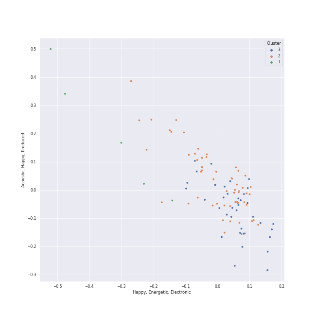

# Clusters in Your Top Songs 2023

## Cluster #1

41 tracks

| Art | Track | Album | Artists | Label | Rank | 💚 | 🔗 |
|:---|:---|:---|:---|:---|---:|:---|:---|
|  | SET ME FREE | READY TO BE | [TWICE](../../../../artists/twice/overview.md) | [Republic Records](../../../../labels/republic_records) | 92 | 💚 | [🔗](https://open.spotify.com/track/4OtVQ2ZxS7yigIjGz5yKg1) |
|  | Thunderous | NOEASY | [Stray Kids](../../../../artists/stray_kids/overview.md) | [Republic Records](../../../../labels/republic_records) | 32 | 💚 | [🔗](https://open.spotify.com/track/0nwTMzpatarzvLvtwwzdCt) |
|  | Dream of You (with R3HAB) | Querencia | [CHUNG HA](../../../../artists/chung_ha/overview.md), R3HAB | [MNH ENTERTAINMENT](../../../../labels/mnh_entertainment) | 233 | 💚 | [🔗](https://open.spotify.com/track/1d8Arh7PushRWWJRs41rSa) |
|  | Pink Venom | BORN PINK | [BLACKPINK](../../../../artists/blackpink/overview.md) | [Interscope Records](../../../../labels/interscope_records), [YG Entertainment](../../../../labels/yg_entertainment) | 40 | 💚 | [🔗](https://open.spotify.com/track/6stcJnJHPO8RrYx5LLz5OP) |
|  | In the morning | GUESS WHO | [ITZY](../../../../artists/itzy/overview.md) | [Republic Records](../../../../labels/republic_records) | 460 | 💚 | [🔗](https://open.spotify.com/track/1Wcr8zrKqbUX0zwN8Dbr16) |
|  | Kill Shot | KILL MY DOUBT | [ITZY](../../../../artists/itzy/overview.md) | [Republic Records](../../../../labels/republic_records) | 141 | 💚 | [🔗](https://open.spotify.com/track/3i7Z0CI7QIwnU4MVL0XJB9) |
|  | Birthday | ‘The ReVe Festival 2022 - Birthday’ | [Red Velvet](../../../../artists/red_velvet/overview.md) | [SM Entertainment](../../../../labels/sm_entertainment) | 83 | 💚 | [🔗](https://open.spotify.com/track/4LJgBT9yo0beHlaBesCFEv) |
|  | Uh-Oh | Uh-Oh | [(G)I-DLE](../../../../artists/(g)i-dle/overview.md) | [Universal Music LLC](../../../../labels/universal_music_llc) | 33 | 💚 | [🔗](https://open.spotify.com/track/1OBb2wZMXKNmtdyyejLIyL) |
|  | Savage | Savage - The 1st Mini Album | [aespa](../../../../artists/aespa/overview.md) | [SM Entertainment](../../../../labels/sm_entertainment) | 1 | 💚 | [🔗](https://open.spotify.com/track/3dbLT62Cvs46Ju7a8gpr36) |
|  | Bubble | TEENFRESH | [STAYC](../../../../artists/stayc/overview.md) | [High Up Entertainment](../../../../labels/high_up_entertainment) | 84 | 💚 | [🔗](https://open.spotify.com/track/4P5ozkI1bxiGxA5rZ27jlO) |
## Cluster #2

36 tracks

| Art | Track | Album | Artists | Label | Rank | 💚 | 🔗 |
|:---|:---|:---|:---|:---|---:|:---|:---|
|  | UNFORGIVEN (feat. Nile Rodgers) | UNFORGIVEN | [LE SSERAFIM](../../../../artists/le_sserafim/overview.md), Nile Rodgers | [SOURCE MUSIC](../../../../labels/source_music) | 176 | 💚 | [🔗](https://open.spotify.com/track/51vRumtqbkNW9wrKfESwfu) |
|  | Stamp On It | Stamp On It - The 1st Mini Album | [GOT the beat](../../../../artists/got_the_beat/overview.md) | [SM Entertainment](../../../../labels/sm_entertainment) | 35 | 💚 | [🔗](https://open.spotify.com/track/0mlxHb4jbPr1PUBUv0WHRS) |
|  | FEVER | BORDER : CARNIVAL | [ENHYPEN](../../../../artists/enhypen/overview.md) | [BELIFT LAB](../../../../labels/belift_lab) | 202 | 💚 | [🔗](https://open.spotify.com/track/0UzymivvUH5s8z4PeWZJaK) |
|  | Bills | DARK BLOOD | [ENHYPEN](../../../../artists/enhypen/overview.md) | [BELIFT LAB](../../../../labels/belift_lab) | 79 | 💚 | [🔗](https://open.spotify.com/track/2nfluhFVrO5OBXPzRWlwlz) |
|  | RBB (Really Bad Boy) | RBB - The 5th Mini Album | [Red Velvet](../../../../artists/red_velvet/overview.md) | [SM Entertainment](../../../../labels/sm_entertainment) | 104 | 💚 | [🔗](https://open.spotify.com/track/4xjVP2Vogo0C72o6Nevq0W) |
|  | Psycho | ‘The ReVe Festival’ Finale | [Red Velvet](../../../../artists/red_velvet/overview.md) | [SM Entertainment](../../../../labels/sm_entertainment) | 211 | 💚 | [🔗](https://open.spotify.com/track/3CYH422oy1cZNoo0GTG1TK) |
|  | Jam Jam | Palette | [IU](../../../../artists/iu/overview.md) | Fave Entertainment | 68 | 💚 | [🔗](https://open.spotify.com/track/3h7WIL3B6nP3171zl6HWj8) |
|  | Oh my god | I trust | [(G)I-DLE](../../../../artists/(g)i-dle/overview.md) | [Universal Music LLC](../../../../labels/universal_music_llc) | 44 | 💚 | [🔗](https://open.spotify.com/track/2DmRXiyn03tOqKgEJXlaiJ) |
|  | I'm Unhappy | MY WORLD - The 3rd Mini Album | [aespa](../../../../artists/aespa/overview.md) | [SM Entertainment](../../../../labels/sm_entertainment), [Warner Records](../../../../labels/warner_records) | 182 | 💚 | [🔗](https://open.spotify.com/track/6fzio74FGqFFsenYkbGPzR) |
|  | Dead Man Runnin’ | 28 Reasons - The 1st Mini Album | [SEULGI](../../../../artists/seulgi/overview.md) | [SM Entertainment](../../../../labels/sm_entertainment) | 152 | 💚 | [🔗](https://open.spotify.com/track/5eFGkCXi83auDi0bcDBEKD) |
## Cluster #3

22 tracks

| Art | Track | Album | Artists | Label | Rank | 💚 | 🔗 |
|:---|:---|:---|:---|:---|---:|:---|:---|
|  | Toddler | INVU - The 3rd Album | [TAEYEON](../../../../artists/taeyeon/overview.md) | [SM Entertainment](../../../../labels/sm_entertainment) | 90 | 💚 | [🔗](https://open.spotify.com/track/73pehvxZUb87PhgyJJpTlw) |
|  | OMG | NewJeans 'OMG' | [NewJeans](../../../../artists/newjeans/overview.md) | [ADOR](../../../../labels/ador) | 91 | 💚 | [🔗](https://open.spotify.com/track/65FftemJ1DbbZ45DUfHJXE) |
|  | BLAME IT ON ME | READY TO BE | [TWICE](../../../../artists/twice/overview.md) | [Republic Records](../../../../labels/republic_records) | 166 | 💚 | [🔗](https://open.spotify.com/track/2hQdmjAhYEuMuqNWZCsz1J) |
|  | MOONLIGHT SUNRISE | READY TO BE | [TWICE](../../../../artists/twice/overview.md) | [Republic Records](../../../../labels/republic_records) | 666 | 💚 | [🔗](https://open.spotify.com/track/5IN9W6eUfk3014My9awagX) |
|  | WALLFLOWER | READY TO BE | [TWICE](../../../../artists/twice/overview.md) | [Republic Records](../../../../labels/republic_records) | 145 | 💚 | [🔗](https://open.spotify.com/track/6EGkbPJrb88STcdfMu1j1y) |
|  | Bite Me | DARK BLOOD | [ENHYPEN](../../../../artists/enhypen/overview.md) | [BELIFT LAB](../../../../labels/belift_lab) | 135 | 💚 | [🔗](https://open.spotify.com/track/7mpdNiaQvygj2rHoxkzMfa) |
|  | Cheshire | CHESHIRE | [ITZY](../../../../artists/itzy/overview.md) | [Republic Records](../../../../labels/republic_records) | 61 | 💚 | [🔗](https://open.spotify.com/track/7ixVW7RobslvMrvlzHYLha) |
|  | enchanted night ~ white night | the Billage of perception: chapter three | [Billlie](../../../../artists/billlie/overview.md) | [MYSTIC STORY](../../../../labels/mystic_story) | 85 | 💚 | [🔗](https://open.spotify.com/track/0rTXn4ovXalJGkJMx5hsnX) |
|  | It's not easy for you | Masterpiece | MISAMO | [WM Japan](../../../../labels/wm_japan) | 89 | 💚 | [🔗](https://open.spotify.com/track/1qNk7XPTbyuO4bsDl0T6nN) |
|  | When I Get Old | When I Get Old | Christopher, [CHUNG HA](../../../../artists/chung_ha/overview.md) | Parlophone Denmark | 112 | 💚 | [🔗](https://open.spotify.com/track/5f2CcxzZoW7hNs1O8NhG6y) |