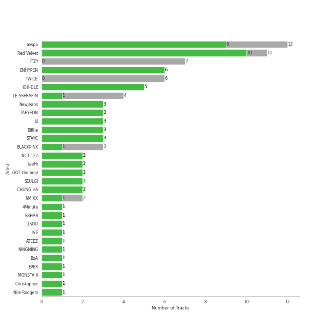
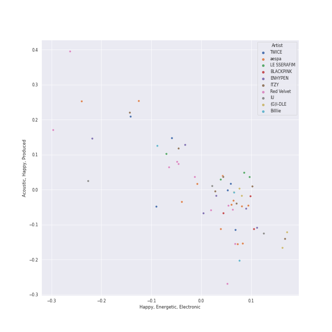
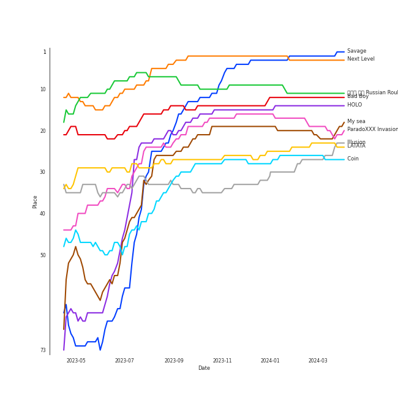
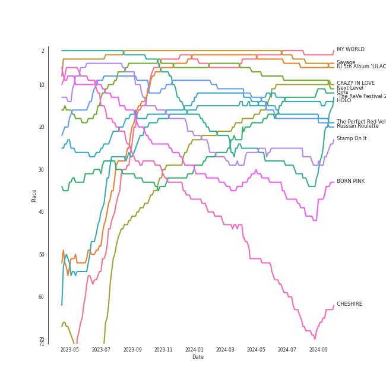
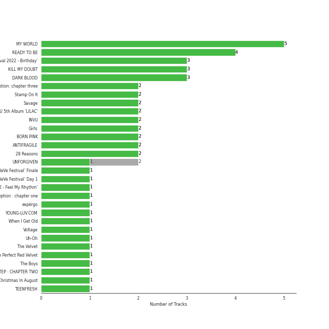
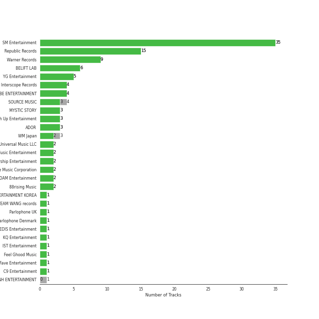
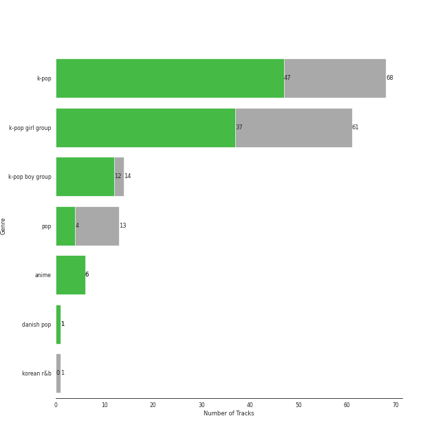
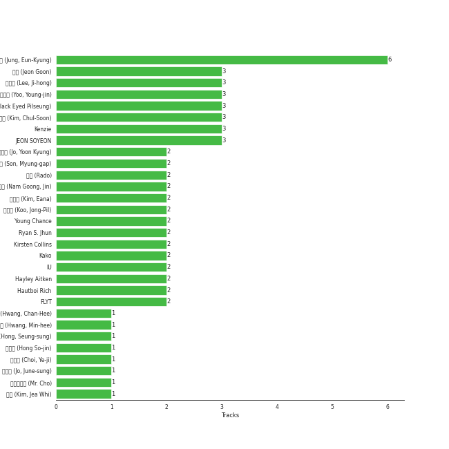
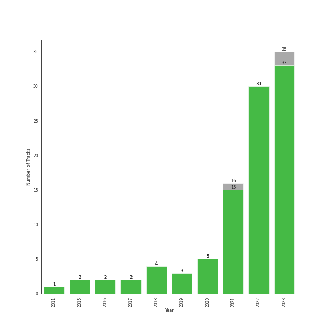

# Your Top Songs 2023

[100 tracks (97 liked) 🔗](https://open.spotify.com/playlist/37i9dQZF1Fa1IIVtEpGUcU)

[See Track Features](audio_features.md)

[See Clusters](clusters/overview.md)

## Top Artists

| Art | Rank | Tracks | 💚 | Artist | 🔗 |
|:---|---:|---:|---:|:---|:---|
|  | 1 | 12 | 12 | [aespa](../../artists/aespa/overview.md) | [🔗](https://open.spotify.com/artist/6YVMFz59CuY7ngCxTxjpxE) |
|  | 2 | 11 | 11 | [Red Velvet](../../artists/red_velvet/overview.md) | [🔗](https://open.spotify.com/artist/1z4g3DjTBBZKhvAroFlhOM) |
|  | 5 | 7 | 7 | [ITZY](../../artists/itzy/overview.md) | [🔗](https://open.spotify.com/artist/2KC9Qb60EaY0kW4eH68vr3) |
|  | 9 | 6 | 6 | [TWICE](../../artists/twice/overview.md) | [🔗](https://open.spotify.com/artist/7n2Ycct7Beij7Dj7meI4X0) |
|  | 7 | 6 | 6 | [ENHYPEN](../../artists/enhypen/overview.md) | [🔗](https://open.spotify.com/artist/5t5FqBwTcgKTaWmfEbwQY9) |
|  | 6 | 5 | 5 | [(G)I-DLE](../../artists/(g)i-dle/overview.md) | [🔗](https://open.spotify.com/artist/2AfmfGFbe0A0WsTYm0SDTx) |
|  | 13 | 4 | 3 | [LE SSERAFIM](../../artists/le_sserafim/overview.md) | [🔗](https://open.spotify.com/artist/4SpbR6yFEvexJuaBpgAU5p) |
|  | 21 | 3 | 3 | [NewJeans](../../artists/newjeans/overview.md) | [🔗](https://open.spotify.com/artist/6HvZYsbFfjnjFrWF950C9d) |
|  | 4 | 3 | 3 | [BLACKPINK](../../artists/blackpink/overview.md) | [🔗](https://open.spotify.com/artist/41MozSoPIsD1dJM0CLPjZF) |
|  | 8 | 3 | 3 | [TAEYEON](../../artists/taeyeon/overview.md) | [🔗](https://open.spotify.com/artist/3qNVuliS40BLgXGxhdBdqu) |

See all 45 artists

| Art | Rank | Tracks | 💚 | Artist | 🔗 |
|:---|---:|---:|---:|:---|:---|
|  | 3 | 3 | 3 | [IU](../../artists/iu/overview.md) | [🔗](https://open.spotify.com/artist/3HqSLMAZ3g3d5poNaI7GOU) |
|  | 22 | 3 | 3 | [Billlie](../../artists/billlie/overview.md) | [🔗](https://open.spotify.com/artist/2GQxKDojobwBjZMPf7aoh0) |
|  | 16 | 3 | 3 | [STAYC](../../artists/stayc/overview.md) | [🔗](https://open.spotify.com/artist/01XYiBYaoMJcNhPokrg0l0) |
|  | 30 | 2 | 2 | [NCT 127](../../artists/nct_127/overview.md) | [🔗](https://open.spotify.com/artist/7f4ignuCJhLXfZ9giKT7rH) |
|  | 11 | 2 | 2 | [LeeHi](../../artists/leehi/overview.md) | [🔗](https://open.spotify.com/artist/7cVZApDoQZpS447nHTsNqu) |
|  | 31 | 2 | 2 | [GOT the beat](../../artists/got_the_beat/overview.md) | [🔗](https://open.spotify.com/artist/6uNxlIP5lzPFf0BHuELOuX) |
|  | 36 | 2 | 2 | [SEULGI](../../artists/seulgi/overview.md) | [🔗](https://open.spotify.com/artist/2QM5S4yO6xHgnNvF0nbZZq) |
|  | 18 | 2 | 2 | [NMIXX](../../artists/nmixx/overview.md) | [🔗](https://open.spotify.com/artist/28ot3wh4oNmoFOdVajibBl) |
|  | 14 | 2 | 1 | [CHUNG HA](../../artists/chung_ha/overview.md) | [🔗](https://open.spotify.com/artist/2PSJ6YriU7JsFucxACpU7Y) |
|  | 124 | 1 | 1 | 4Minute | [🔗](https://open.spotify.com/artist/6cdC1cwqh3eJAXaxXJt2jv) |
|  | 72 | 1 | 1 | [BIBI](../../artists/bibi/overview.md) | [🔗](https://open.spotify.com/artist/6UbmqUEgjLA6jAcXwbM1Z9) |
|  | 306 | 1 | 1 | JISOO | [🔗](https://open.spotify.com/artist/6UZ0ba50XreR4TM8u322gs) |
|  | 17 | 1 | 1 | [IVE](../../artists/ive/overview.md) | [🔗](https://open.spotify.com/artist/6RHTUrRF63xao58xh9FXYJ) |
|  | 46 | 1 | 1 | [ATEEZ](../../artists/ateez/overview.md) | [🔗](https://open.spotify.com/artist/68KmkJeZGfwe1OUaivBa2L) |
|  | 78 | 1 | 1 | NINGNING | [🔗](https://open.spotify.com/artist/5t1uryofgueHrjrryqX8vM) |
|  | 32 | 1 | 1 | [BoA](../../artists/boa/overview.md) | [🔗](https://open.spotify.com/artist/4muJrGMndyYWqZtfk8OWy4) |
|  | 135 | 1 | 1 | EPEX | [🔗](https://open.spotify.com/artist/4e2umhzNHTSeQnSCWPN0uT) |
|  | 193 | 1 | 1 | MONSTA X | [🔗](https://open.spotify.com/artist/4TnGh5PKbSjpYqpIdlW5nz) |
|  | 101 | 1 | 1 | Christopher | [🔗](https://open.spotify.com/artist/3zDRCqOhJXJfS2YWOEwGMC) |
|  | 99 | 1 | 1 | Nile Rodgers | [🔗](https://open.spotify.com/artist/3yDIp0kaq9EFKe07X1X2rz) |
|  | 42 | 1 | 1 | [EVERGLOW](../../artists/everglow/overview.md) | [🔗](https://open.spotify.com/artist/3ZZzT0naD25RhY2uZvIKkJ) |
|  | 35 | 1 | 1 | [TEN](../../artists/ten/overview.md) | [🔗](https://open.spotify.com/artist/3Q5Qep7ytrjVleNnMnntgQ) |
|  | 76 | 1 | 1 | [TREASURE](../../artists/treasure/overview.md) | [🔗](https://open.spotify.com/artist/3KonOYiLsU53m4yT7gNotP) |
|  | 10 | 1 | 1 | [Stray Kids](../../artists/stray_kids/overview.md) | [🔗](https://open.spotify.com/artist/2dIgFjalVxs4ThymZ67YCE) |
|  | 44 | 1 | 1 | nævis | [🔗](https://open.spotify.com/artist/2067CjQ2nC56cRZX8goeHg) |
|  | 66 | 1 | 1 | BSS | [🔗](https://open.spotify.com/artist/1uAT5bTSp6dWbNmixIUP5t) |
|  | 77 | 1 | 1 | [Jackson Wang](../../artists/jackson_wang/overview.md) | [🔗](https://open.spotify.com/artist/1kfWoWgCugPkyxQP8lkRlY) |
|  | 50 | 1 | 1 | JOY | [🔗](https://open.spotify.com/artist/0sYpJ0nCC8AlDrZFeAA7ub) |
|  | 65 | 1 | 1 | Lee Young Ji | [🔗](https://open.spotify.com/artist/0Y2AcMPMpeuPXtPQGVvRBq) |
|  | 20 | 1 | 1 | [Girls' Generation](../../artists/girls__generation/overview.md) | [🔗](https://open.spotify.com/artist/0Sadg1vgvaPqGTOjxu0N6c) |
|  | 41 | 1 | 1 | MISAMO | [🔗](https://open.spotify.com/artist/0IwZVmMMGE7nNXS7vN9SIo) |
|  | 26 | 1 | 1 | [WENDY](../../artists/wendy/overview.md) | [🔗](https://open.spotify.com/artist/0FRUZvZNPzM3YJMABJxf2K) |
|  | 125 | 1 | 1 | [THE BOYZ](../../artists/the_boyz/overview.md) | [🔗](https://open.spotify.com/artist/0CmvFWTX9zmMNCUi6fHtAx) |
|  | 73 | 1 | 0 | JIHYO | [🔗](https://open.spotify.com/artist/7F1iAHRYxR3MY7yAEuFqgL) |
|  | 141 | 1 | 0 | R3HAB | [🔗](https://open.spotify.com/artist/6cEuCEZu7PAE9ZSzLLc2oQ) |

## Top Tracks

Most and least listened tracks

| Rank | ​ | Most listened tracks | Rank | ​​ | Least listened tracks |
|---:|:---|:---|---:|:---|:---|
| 1 |  | [Savage](../../artists/aespa/overview.md) | 976 |  | [FEARLESS (2023 Ver.)](../../artists/le_sserafim/overview.md) |
| 4 |  | [Welcome To MY World (feat. nævis)](../../artists/aespa/overview.md) | 976 |  | Killin′ Me Good |
| 5 |  | [LOCO](../../artists/itzy/overview.md) | 860 |  | [MOONLIGHT SUNRISE](../../artists/twice/overview.md) |
| 6 |  | [Next Level](../../artists/aespa/overview.md) | 857 |  | [LA DI DA](../../artists/everglow/overview.md) |
| 7 |  | [Illusion](../../artists/aespa/overview.md) | 698 |  | Beautiful Liar |
| 10 |  | [HOLO](../../artists/leehi/overview.md) | 582 |  | [RUN2U](../../artists/stayc/overview.md) |
| 17 |  | [Bad Boy](../../artists/red_velvet/overview.md) | 575 |  | FLOWER |
| 18 |  | [ParadoXXX Invasion](../../artists/enhypen/overview.md) | 484 |  | [Voltage](../../artists/itzy/overview.md) |
| 19 |  | [러시안 룰렛 Russian Roulette](../../artists/red_velvet/overview.md) | 378 |  | [LIP GLOSS](../../artists/the_boyz/overview.md) |
| 21 |  | [My sea](../../artists/iu/overview.md) | 377 |  | [Go Big or Go Home](../../artists/enhypen/overview.md) |

## Top Albums

| Art | Rank | Tracks | 💚 | Album | Release Date | 🔗 |
|:---|---:|---:|---:|:---|:---|:---|
|  | 2 | 5 | 5 | MY WORLD - The 3rd Mini Album | 2023-05-08 | [🔗](https://open.spotify.com/album/69xF8jTd0c4Zoo7DT3Rwrn) |
|  | 70 | 4 | 4 | READY TO BE | 2023-03-10 | [🔗](https://open.spotify.com/album/7hzP5i7StxYG4StECA0rrJ) |
|  | 13 | 3 | 3 | ‘The ReVe Festival 2022 - Birthday’ | 2022-11-28 | [🔗](https://open.spotify.com/album/58OR7UoaJkJzqeQGClHzh1) |
|  | 74 | 3 | 3 | KILL MY DOUBT | 2023-07-31 | [🔗](https://open.spotify.com/album/6P01cKb7sdwfnNpuMLNEik) |
|  | 27 | 3 | 3 | DARK BLOOD | 2023-05-22 | [🔗](https://open.spotify.com/album/7q65W5gVANjh1j1KXLeU0f) |
|  | 75 | 2 | 2 | the Billage of perception: chapter three | 2023-03-28 | [🔗](https://open.spotify.com/album/5bt0sTLia4il2rIlpqUo5g) |
|  | 23 | 2 | 2 | Stamp On It - The 1st Mini Album | 2023-01-16 | [🔗](https://open.spotify.com/album/2Gxd1fr4RFHVNx6IxGr9I7) |
|  | 5 | 2 | 2 | Savage - The 1st Mini Album | 2021-10-05 | [🔗](https://open.spotify.com/album/3vyyDkvYWC36DwgZCYd3Wu) |
|  | 6 | 2 | 2 | IU 5th Album 'LILAC' | 2021-03-25 | [🔗](https://open.spotify.com/album/01dPJcwyht77brL4JQiR8R) |
|  | 31 | 2 | 2 | INVU - The 3rd Album | 2022-02-14 | [🔗](https://open.spotify.com/album/7i2YLTVQ0dyngRuUqtGmr9) |

See all 77 albums

| Art | Rank | Tracks | 💚 | Album | Release Date | 🔗 |
|:---|---:|---:|---:|:---|:---|:---|
|  | 12 | 2 | 2 | Girls - The 2nd Mini Album | 2022-07-08 | [🔗](https://open.spotify.com/album/4w1dbvUy1crv0knXQvcSeY) |
|  | 33 | 2 | 2 | BORN PINK | 2022-09-16 | [🔗](https://open.spotify.com/album/7jaSNQUBJbvfbZHLNFrV7P) |
|  | 65 | 2 | 2 | ANTIFRAGILE | 2022-10-17 | [🔗](https://open.spotify.com/album/3u0ggfmK0vjuHMNdUbtaa9) |
|  | 64 | 2 | 2 | 28 Reasons - The 1st Mini Album | 2022-10-04 | [🔗](https://open.spotify.com/album/1t5a29WYbJj83iy3RNICHw) |
|  | 114 | 2 | 1 | UNFORGIVEN | 2023-05-01 | [🔗](https://open.spotify.com/album/4Oz7K9DRwwGMN49i4NbVDT) |
|  | 139 | 1 | 1 | ‘The ReVe Festival’ Finale | 2019-12-23 | [🔗](https://open.spotify.com/album/3rVtm00UfbuzWOewdm4iYM) |
|  | 127 | 1 | 1 | ‘The ReVe Festival’ Day 1 | 2019-06-19 | [🔗](https://open.spotify.com/album/2nLEiP268mSFZHW5dajM4R) |
|  | 80 | 1 | 1 | ‘The ReVe Festival 2022 - Feel My Rhythm’ | 2022-03-21 | [🔗](https://open.spotify.com/album/3HgoCO9wWuPcNhz8Ip4C46) |
|  | 72 | 1 | 1 | the Billage of perception : chapter one | 2021-11-10 | [🔗](https://open.spotify.com/album/1kp4txZsSpDNR4EoDFi2LD) |
|  | 109 | 1 | 1 | expérgo | 2023-03-20 | [🔗](https://open.spotify.com/album/6GbCvETnCVvkpvK6qCqTYS) |
|  | 261 | 1 | 1 | YOUNG-LUV.COM | 2022-02-21 | [🔗](https://open.spotify.com/album/2xPdgNkM4yIQmP7axJ1T1o) |
|  | 115 | 1 | 1 | When I Get Old | 2022-10-20 | [🔗](https://open.spotify.com/album/3mJMHqT2w0HwjQkneNVE14) |
|  | 340 | 1 | 1 | Voltage | 2022-03-23 | [🔗](https://open.spotify.com/album/3MXVqfk9VG3B757nLlow0D) |
|  | 52 | 1 | 1 | Uh-Oh | 2019-06-26 | [🔗](https://open.spotify.com/album/3PzrNuMGWGpp8WOfrmpkaU) |
|  | 44 | 1 | 1 | The Velvet - The 2nd Mini Album | 2016-03-17 | [🔗](https://open.spotify.com/album/2qgl7dAgslqL1w2l2wQhMA) |
|  | 19 | 1 | 1 | The Perfect Red Velvet - The 2nd Album Repackage | 2018-01-29 | [🔗](https://open.spotify.com/album/0OkJThJls8FO1lutMzMDJ0) |
|  | 59 | 1 | 1 | The Boys - The 3rd Album | 2011-10-19 | [🔗](https://open.spotify.com/album/4vGkZl9P0sKxupLdJE7ndS) |
|  | 120 | 1 | 1 | THE SECOND STEP : CHAPTER TWO | 2022-10-04 | [🔗](https://open.spotify.com/album/4l5YvRcmno5RMKZCZp1j0g) |
|  | 265 | 1 | 1 | THE BOYZ 2ND ALBUM [PHANTASY] Pt.1 Christmas In August | 2023-08-07 | [🔗](https://open.spotify.com/album/6j0bF8s6Kptbr4y8tuIhOY) |
|  | 73 | 1 | 1 | TEENFRESH | 2023-08-16 | [🔗](https://open.spotify.com/album/4P5wnRQTBnnjNbjt7A6S6x) |
|  | 178 | 1 | 1 | Sticker - The 3rd Album | 2021-09-17 | [🔗](https://open.spotify.com/album/6nYbIKGcTmKM5BAlJPPcad) |
|  | 140 | 1 | 1 | Star To A Young Culture | 2020-11-12 | [🔗](https://open.spotify.com/album/4PrRd0lIunUEiiE5rbZklR) |
|  | 71 | 1 | 1 | SQUARE UP | 2018-06-15 | [🔗](https://open.spotify.com/album/0wOiWrujRbxlKEGWRQpKYc) |
|  | 111 | 1 | 1 | SPIN OFF : FROM THE WITNESS | 2022-12-30 | [🔗](https://open.spotify.com/album/0NQQk6vo9LOOwKjZc2iUwm) |
|  | 20 | 1 | 1 | Russian Roulette - The 3rd Mini Album | 2016-09-07 | [🔗](https://open.spotify.com/album/6MNlcai3skKLKv5syzFwC3) |
|  | 470 | 1 | 1 | REASON | 2023-01-09 | [🔗](https://open.spotify.com/album/5evr2BAxQmxyF8dZyaezzS) |
|  | 87 | 1 | 1 | RBB - The 5th Mini Album | 2018-11-30 | [🔗](https://open.spotify.com/album/7rNIvLwIpB2mwOzk20iqIl) |
|  | 61 | 1 | 1 | Palette | 2017-04-21 | [🔗](https://open.spotify.com/album/5V8n6fqyAPxvFTibPhQVcp) |
|  | 11 | 1 | 1 | Next Level | 2021-05-17 | [🔗](https://open.spotify.com/album/2CzbrboOLzeRoaaH1N5K0N) |
|  | 107 | 1 | 1 | NewJeans 1st EP 'New Jeans' | 2022-08-01 | [🔗](https://open.spotify.com/album/1HMLpmZAnNyl9pxvOnTovV) |
|  | 104 | 1 | 1 | NewJeans 'OMG' | 2023-01-02 | [🔗](https://open.spotify.com/album/45ozep8uHHnj5CCittuyXj) |
|  | 35 | 1 | 1 | NOEASY | 2021-08-23 | [🔗](https://open.spotify.com/album/558tpdCejjVQNFAumRAeQj) |
|  | 60 | 1 | 1 | My Voice - The 1st Album | 2017-02-28 | [🔗](https://open.spotify.com/album/6DlCl3hBP1Gwhn0tgitGfN) |
|  | 30 | 1 | 1 | Masterpiece | 2023-07-26 | [🔗](https://open.spotify.com/album/3qmO83vO1SsdmP1Y0ljhSQ) |
|  | 393 | 1 | 1 | ME | 2023-03-31 | [🔗](https://open.spotify.com/album/4QuczuzDZNzCDli5Gz6DQ0) |
|  | 21 | 1 | 1 | MANIFESTO : DAY 1 | 2022-07-04 | [🔗](https://open.spotify.com/album/5J8MNLLViH5zqM6VoGErz8) |
|  | 242 | 1 | 1 | MAGIC MAN | 2022-09-09 | [🔗](https://open.spotify.com/album/2VZ4og2ZbwyTQ3X1rbgCe1) |
|  | 102 | 1 | 1 | Lowlife Princess: Noir | 2022-11-18 | [🔗](https://open.spotify.com/album/0AwCgoJKJUOgLp1imhnxuH) |
|  | 67 | 1 | 1 | Ice Cream Cake - The 1st Mini Album | 2015-03-17 | [🔗](https://open.spotify.com/album/27cBQ5FDqv0xLgiJ7qNpZr) |
|  | 106 | 1 | 1 | I've IVE | 2023-04-10 | [🔗](https://open.spotify.com/album/38VzP4yWfHdHafITKKRHEB) |
|  | 39 | 1 | 1 | I trust | 2020-04-06 | [🔗](https://open.spotify.com/album/57sl8AvqVqm4Fadre0z8FQ) |
|  | 96 | 1 | 1 | I love | 2022-10-17 | [🔗](https://open.spotify.com/album/2Hyuin3i1cSZ1FlQFeCPZH) |
|  | 92 | 1 | 1 | I feel | 2023-05-15 | [🔗](https://open.spotify.com/album/3PQZnr5gf699uYEaGH93uG) |
|  | 41 | 1 | 1 | I am | 2018-05-02 | [🔗](https://open.spotify.com/album/1GtPnOiHxCnoZPCiLcKj22) |
|  | 40 | 1 | 1 | Hold On Tight | 2023-03-30 | [🔗](https://open.spotify.com/album/4bWGRs1SqNwFXaRDXRAANN) |
|  | 38 | 1 | 1 | Hello - Special Album | 2021-05-31 | [🔗](https://open.spotify.com/album/37mRfTDwQzVbHihypYY8oE) |
|  | 14 | 1 | 1 | HOLO | 2020-07-23 | [🔗](https://open.spotify.com/album/5xq9sm0jGMMDu5LifpBBo1) |
|  | 198 | 1 | 1 | GUESS WHO | 2021-04-30 | [🔗](https://open.spotify.com/album/4lS8nhX8cplsYPzKjvhw6G) |
|  | 103 | 1 | 1 | Formula of Love: O+T=<3 | 2021-11-12 | [🔗](https://open.spotify.com/album/5052Ip89wdW8EGdpjEpNeq) |
|  | 36 | 1 | 1 | Eyes Wide Open | 2020-10-26 | [🔗](https://open.spotify.com/album/33jypnU7WULxPaVrjj4RXH) |
|  | 180 | 1 | 1 | EPEX 5th EP Album Prelude of Love Chapter 2. 'Growing Pains' | 2023-04-26 | [🔗](https://open.spotify.com/album/7c4HuyVRABrlh7eOdhozwd) |
|  | 57 | 1 | 1 | Ditto | 2022-12-19 | [🔗](https://open.spotify.com/album/7bnqo1fdJU9nSfXQd3bSMe) |
|  | 119 | 1 | 1 | DIMENSION : DILEMMA | 2021-10-12 | [🔗](https://open.spotify.com/album/5jGRqioNCSWZGBl3QmyuFI) |
|  | 152 | 1 | 1 | Crazy | 2015-02-09 | [🔗](https://open.spotify.com/album/5ooERKclQluBVu00PIH9Xm) |
|  | 10 | 1 | 1 | CRAZY IN LOVE | 2021-09-24 | [🔗](https://open.spotify.com/album/4U7rGOkJgtxs27H9L93Xli) |
|  | 62 | 1 | 1 | CHESHIRE | 2022-11-30 | [🔗](https://open.spotify.com/album/2a1ezg7hE6Dyuymv1aCnkm) |
|  | 79 | 1 | 1 | Birthday - SM STATION : NCT LAB | 2022-10-26 | [🔗](https://open.spotify.com/album/6tcPTRUC3gwmG1iyWyzRzr) |
|  | 29 | 1 | 1 | Better Things | 2023-08-18 | [🔗](https://open.spotify.com/album/1SHLOv0DDdRecK60z86Lth) |
|  | 49 | 1 | 1 | BSS 1st Single Album 'SECOND WIND' | 2023-02-06 | [🔗](https://open.spotify.com/album/4dHtpne5cAAGgDYFNHu7jW) |
|  | 170 | 1 | 1 | BORDER : CARNIVAL | 2021-04-26 | [🔗](https://open.spotify.com/album/4LGYBcRsteiXjcPD4QQvxv) |
|  | 232 | 1 | 1 | AD MARE | 2022-02-22 | [🔗](https://open.spotify.com/album/2QbA97qjlAs81t6kVS6zBk) |
|  | 51 | 1 | 1 | 4 ONLY | 2021-09-09 | [🔗](https://open.spotify.com/album/1DKgZeAYrjslAPZVMe6EFt) |
|  | 66 | 1 | 1 | 2022 Winter SMTOWN : SMCU PALACE | 2022-12-26 | [🔗](https://open.spotify.com/album/1HwnXJfZx8N8qDfzwUbxcw) |
|  | 133 | 1 | 1 | 2 Baddies - The 4th Album | 2022-09-16 | [🔗](https://open.spotify.com/album/6p80QT3z7kOHpYdnsItQTQ) |
|  | 572 | 1 | 1 | -77.82x-78.29 | 2020-09-21 | [🔗](https://open.spotify.com/album/4kMID9cggWEko9mOb1zisI) |
|  | 644 | 1 | 0 | ZONE | 2023-08-18 | [🔗](https://open.spotify.com/album/4g2dB5xOOVWWyYpaPn77pZ) |
|  | 221 | 1 | 0 | Querencia | 2021-02-15 | [🔗](https://open.spotify.com/album/1p2OBhqq0d1N8awjHV9xA3) |

## Top Record Labels

| Tracks | 💚 | Label |
|---:|---:|:---|
| 35 | 35 | [SM Entertainment](../../labels/sm_entertainment/overview.md) |
| 15 | 15 | [Republic Records](../../labels/republic_records/overview.md) |
| 9 | 9 | [Warner Records](../../labels/warner_records/overview.md) |
| 6 | 6 | [BELIFT LAB](../../labels/belift_lab/overview.md) |
| 5 | 5 | [YG Entertainment](../../labels/yg_entertainment/overview.md) |
| 4 | 4 | [Interscope Records](../../labels/interscope_records/overview.md) |
| 4 | 4 | [CUBE ENTERTAINMENT](../../labels/cube_entertainment/overview.md) |
| 4 | 3 | [SOURCE MUSIC](../../labels/source_music/overview.md) |
| 3 | 3 | [MYSTIC STORY](../../labels/mystic_story/overview.md) |
| 3 | 3 | [High Up Entertainment](../../labels/high_up_entertainment/overview.md) |

See all 29 labels

| Tracks | 💚 | Label |
|---:|---:|:---|
| 3 | 3 | [ADOR](../../labels/ador/overview.md) |
| 3 | 2 | [WM Japan](../../labels/wm_japan/overview.md) |
| 2 | 2 | [Universal Music LLC](../../labels/universal_music_llc/overview.md) |
| 2 | 2 | [Stone Music Entertainment](../../labels/stone_music_entertainment/overview.md) |
| 2 | 2 | [Starship Entertainment](../../labels/starship_entertainment/overview.md) |
| 2 | 2 | [Genie Music Corporation](../../labels/genie_music_corporation/overview.md) |
| 2 | 2 | [EDAM Entertainment](../../labels/edam_entertainment/overview.md) |
| 2 | 2 | [88rising Music](../../labels/88rising_music/overview.md) |
| 1 | 1 | YUEHUA ENTERTAINMENT KOREA |
| 1 | 1 | TEAM WANG records |
| 1 | 1 | [Parlophone UK](../../labels/parlophone_uk/overview.md) |
| 1 | 1 | Parlophone Denmark |
| 1 | 1 | [PLEDIS Entertainment](../../labels/pledis_entertainment/overview.md) |
| 1 | 1 | [KQ Entertainment](../../labels/kq_entertainment/overview.md) |
| 1 | 1 | IST Entertainment |
| 1 | 1 | Feel Ghood Music |
| 1 | 1 | Fave Entertainment |
| 1 | 1 | C9 Entertainment |
| 1 | 0 | [MNH ENTERTAINMENT](../../labels/mnh_entertainment/overview.md) |

## Genres

| Tracks | 💚 | Genre |
|---:|---:|:---|
| 68 | 67 | [k-pop](../../genres/k-pop/overview.md) |
| 61 | 60 | [k-pop girl group](../../genres/k-pop_girl_group/overview.md) |
| 14 | 14 | [k-pop boy group](../../genres/k-pop_boy_group/overview.md) |
| 13 | 13 | [pop](../../genres/pop/overview.md) |
| 6 | 6 | [anime](../../genres/anime/overview.md) |
| 3 | 3 | [5th gen k-pop](../../genres/5th_gen_k-pop/overview.md) |
| 1 | 1 | [korean r&b](../../genres/korean_r_b/overview.md) |
| 1 | 1 | danish pop |

## Top Producers

| Art | Producer | Tracks | Credit Types |
|:---|:---|---:|:---|
| | [정은경 (Jung, Eun-Kyung)](../../producers/정은경_(jung,_eun-kyung)/overview.md) | 6 | Producer |
| | [유영진 (Yoo, Young-jin)](../../producers/유영진_(yoo,_young-jin)/overview.md) | 4 | Arranger, Lyricist, Producer, Songwriter |
| | [블랙아이드필승 (Black Eyed Pilseung)](../../producers/블랙아이드필승_(black_eyed_pilseung)/overview.md) | 3 | Arranger, Lyricist, Songwriter |
| | [김병석 (Kim, Byung-seok)](../../producers/김병석_(kim,_byung-seok)/overview.md) | 3 | Arranger, Lyricist, Producer, Songwriter |
|  | [JEON SOYEON](../../artists/jeon_soyeon/overview.md) | 3 | Arranger, Lyricist, Songwriter |
| | [SCORE](../../producers/score/overview.md) | 3 | Arranger, Lyricist, Producer, Songwriter |
| | 13 | 3 | Producer |
| | 이지홍 (Lee, Ji-hong) | 3 | Producer |
| | [24](../../producers/24/overview.md) | 3 | Arranger, Songwriter |
| | [Tony Maserati](../../producers/tony_maserati/overview.md) | 3 | Producer |

View all

| Art | Producer | Tracks | Credit Types |
|:---|:---|---:|:---|
| | [조윤경 (Jo, Yoon Kyung)](../../producers/조윤경_(jo,_yoon_kyung)/overview.md) | 3 | Lyricist, Songwriter |
| | [Kenzie](../../producers/kenzie/overview.md) | 3 | Songwriter, Arranger, Lyricist |
| | [전군 (Jeon Goon)](../../producers/전군_(jeon_goon)/overview.md) | 3 | Lyricist, Songwriter |
| | 황민희 (Hwang, Min-hee) | 3 | Producer |
| | [Ryan S. Jhun](../../producers/ryan_s__jhun/overview.md) | 3 | Arranger, Songwriter |
| | [TEDDY](../../producers/teddy/overview.md) | 3 | Arranger, Lyricist, Songwriter, Producer |
| | 김철순 (Kim, Chul-Soon) | 3 | Producer |
| | 이경원 (Lee, Kyung-won) | 2 | Producer |
| | [구종필 (Koo, Jong-Pil)](../../producers/구종필_(koo,_jong-pil)/overview.md) | 2 | Producer |
| | 이연수 (Lee, Yeon-soo) | 2 | Producer |
| | Young Chance | 2 | Lyricist, Songwriter |
| | Kirsten Collins | 2 | Songwriter |
| | 손명갑 (Son, Myung-gap) | 2 | Producer |
| | Chris Galland | 2 | Producer |
| | 남궁진 (Nam Goong, Jin) | 2 | Producer |
| | [R.Tee](../../producers/r_tee/overview.md) | 2 | Arranger, Songwriter |
| | Danny Chung | 2 | Lyricist |
| | [엄세희 (Um, Se-Hee)](../../producers/엄세희_(um,_se-hee)/overview.md) | 2 | Producer |
| | Hautboi Rich | 2 | Songwriter |
| | [방시혁 (Bang, Si-Hyuk)](../../producers/방시혁_(bang,_si-hyuk)/overview.md) | 2 | Lyricist, Songwriter |
| | 조씨아저씨 (Mr. Cho) | 2 | Producer |
| | [이수만 (Lee, Soo-Man)](../../producers/이수만_(lee,_soo-man)/overview.md) | 2 | Producer |
| | [이상엽 (Lee, Sang-yeob)](../../producers/이상엽_(lee,_sang-yeob)/overview.md) | 2 | Producer |
|  | [IU](../../artists/iu/overview.md) | 2 | Lyricist, Songwriter |
| | [danke](../../producers/danke/overview.md) | 2 | Lyricist, Songwriter |
| | Kyler Niko | 2 | Lyricist, Songwriter |
| | [Manny Marroquin](../../producers/manny_marroquin/overview.md) | 2 | Producer |
| | YOUNGJU BANG | 2 | Producer |
| | Kako | 2 | Arranger, Songwriter |
| | [라도 (Rado)](../../producers/라도_(rado)/overview.md) | 2 | Arranger |
| | [FLYT](../../producers/flyt/overview.md) | 2 | Arranger, Songwriter |
| | 빅싼초 (Bicksancho) | 2 | Arranger, Songwriter, Lyricist |
| | [김이나 (Kim, Eana)](../../producers/김이나_(kim,_eana)/overview.md) | 2 | Lyricist |
| | Hayley Aitken | 2 | Arranger, Songwriter |
| | [Josh Gudwin](../../producers/josh_gudwin/overview.md) | 2 | Producer |
| | [Supreme Boi](../../producers/supreme_boi/overview.md) | 2 | Lyricist, Songwriter |
| | 전부연 (Jeon, Bu-yeon) | 2 | Producer |
| | Liam Kevany | 1 | Producer, Songwriter |
| | DOM | 1 | Arranger, Songwriter |
| | Jeremy Reeves | 1 | Lyricist, Songwriter |
| | Nathalie Blue | 1 | Lyricist, Songwriter |
| | Eline Noelia | 1 | Songwriter |
| | Audun Agnar | 1 | Arranger, Songwriter |
| | 황찬희 (Hwang, Chan-Hee) | 1 | Arranger, Producer, Songwriter |
|  | [Jackson Wang](../../artists/jackson_wang/overview.md) | 1 | Songwriter |
| | 노민지 (Noh, Min-ji) | 1 | Producer |
| | 손영진 (Son, Young-jin) | 1 | Lyricist, Songwriter |
| | Jason Robert | 1 | Producer |
| | Daniel "Obi" Klein | 1 | Lyricist, Songwriter |
| | [이민수 (이민수)](../../producers/이민수_(이민수)/overview.md) | 1 | Arranger, Songwriter |
| | MJ | 1 | Producer |
| | 김준혁 (Kim Joonhyuk) | 1 | Producer |
| | 임찬미 (Kim, Chan-mi) | 1 | Producer |
| | Markus Lindell | 1 | Arranger, Songwriter |
| | 서재우 (Seo, Jae-woo) | 1 | Lyricist, Songwriter |
| | Dem Jointz | 1 | Arranger, Songwriter |
| | Kris Jana | 1 | Lyricist, Songwriter |
| | IDO | 1 | Arranger, Songwriter |
| | Tay Jasper | 1 | Songwriter |
| | [Arschtritt Lindgren](../../producers/arschtritt_lindgren/overview.md) | 1 | Producer, Songwriter |
| | Boy Matthews | 1 | Lyricist |
|  | Bekuh Boom | 1 | Songwriter |
| | 밍지션 (Ming, Jisyeon) | 1 | Producer |
| | MooF | 1 | Arranger, Songwriter |
| | BLVSH | 1 | Lyricist, Songwriter |
| | Brandon Green | 1 | Arranger, Songwriter |
| | Belle Humble | 1 | Arranger, Songwriter |
| | IMLAY | 1 | Arranger |
| | [Pop Time](../../producers/pop_time/overview.md) | 1 | Arranger, Songwriter |
| | Cazzi Opeia | 1 | Songwriter |
| | 이우현 (Lee, Woo-hyun) | 1 | Arranger, Lyricist, Producer, Songwriter |
| | 김일호 (Kim, Il-Ho) | 1 | Producer |
| | [정의석 (Jung, Euisuk)](../../producers/정의석_(jung,_euisuk)/overview.md) | 1 | Producer |
| | DRK | 1 | Producer |
| | 최예지 (Choi, Ye-ji) | 1 | Producer |
|  | R3HAB | 1 | Producer |
| | Vince | 1 | Lyricist |
| | Jia Lih | 1 | Arranger, Songwriter |
| | 고현정 (Go, Hyeon-Jeong) | 1 | Producer |
| | 이민규 (Lee, Min-kyu) | 1 | Producer |
| | 오유원 (Oh, Yoo-won) | 1 | Lyricist |
| | 신재빈 (Shin, Jae Bin) | 1 | Producer |
| | 오성근 (Oh, Seong-Keun) | 1 | Producer |
| | 이우민 (Yiwoomin) | 1 | Arranger, Lyricist, Producer, Songwriter |
| | Poptime | 1 | Arranger, Songwriter |
| | 72 | 1 | Songwriter |
| | Kaedi Dalley | 1 | Lyricist, Songwriter |
| | 최혜진 (Cho, Hye-jin) | 1 | Producer |
| | Jack Samson | 1 | Songwriter |
| | 홍승성 (Hong, Seung-sung) | 1 | Producer |

## Years

View all years

| Year | Number of Tracks |
|:---|---:|
| [2023](2023/overview.md) | 35 |
| [2022](2022/overview.md) | 30 |
| 2021 | 16 |
| 2020 | 5 |
| 2019 | 3 |
| 2018 | 4 |
| 2017 | 2 |
| 2016 | 2 |
| 2015 | 2 |
| 2011 | 1 |

| ​ | 10 newest albums | ​​ | 10 oldest albums |
|:---|:---|:---|:---|
|  | Better Things (2023-08-18) |  | The Boys - The 3rd Album (2011-10-19) |
|  | ZONE (2023-08-18) |  | Crazy (2015-02-09) |
|  | TEENFRESH (2023-08-16) |  | Ice Cream Cake - The 1st Mini Album (2015-03-17) |
|  | THE BOYZ 2ND ALBUM [PHANTASY] Pt.1 Christmas In August (2023-08-07) |  | The Velvet - The 2nd Mini Album (2016-03-17) |
|  | KILL MY DOUBT (2023-07-31) |  | Russian Roulette - The 3rd Mini Album (2016-09-07) |
|  | Masterpiece (2023-07-26) |  | My Voice - The 1st Album (2017-02-28) |
|  | DARK BLOOD (2023-05-22) |  | Palette (2017-04-21) |
|  | I feel (2023-05-15) |  | The Perfect Red Velvet - The 2nd Album Repackage (2018-01-29) |
|  | MY WORLD - The 3rd Mini Album (2023-05-08) |  | I am (2018-05-02) |
|  | UNFORGIVEN (2023-05-01) |  | SQUARE UP (2018-06-15) |